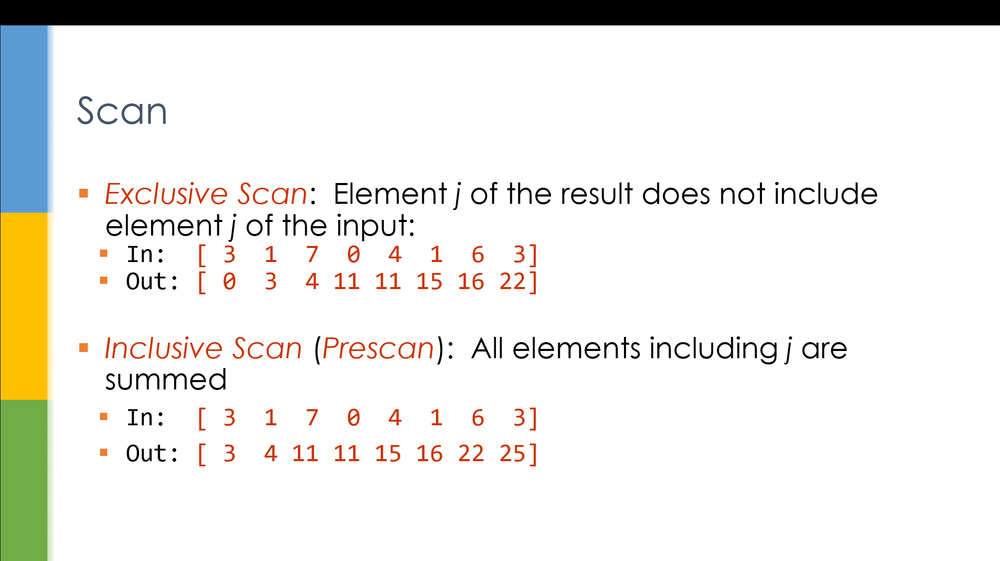
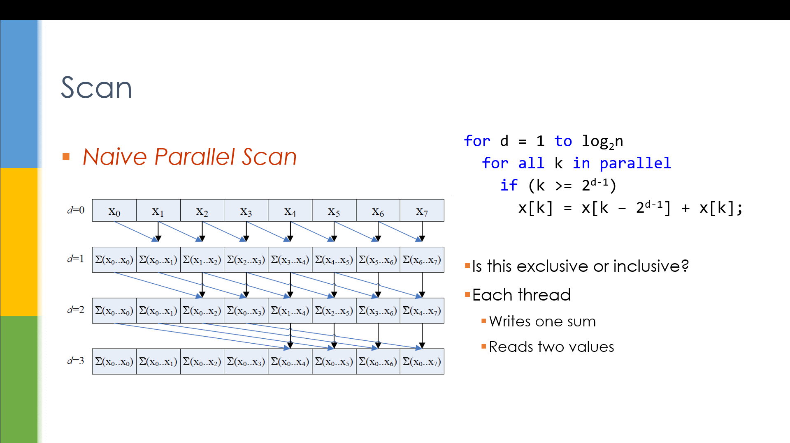
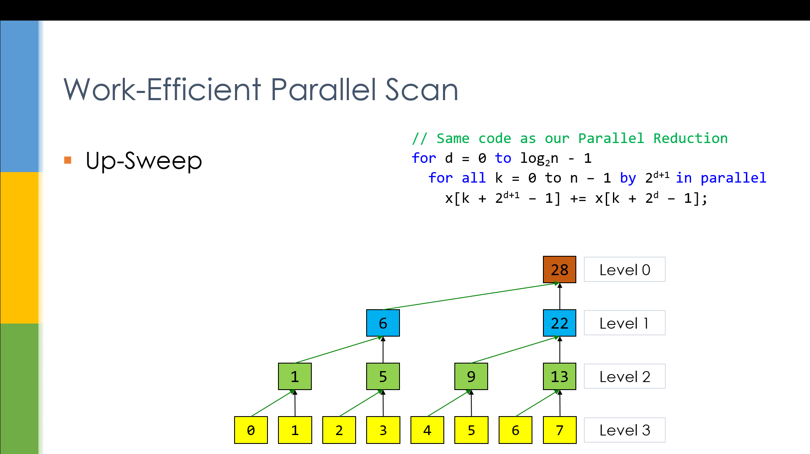
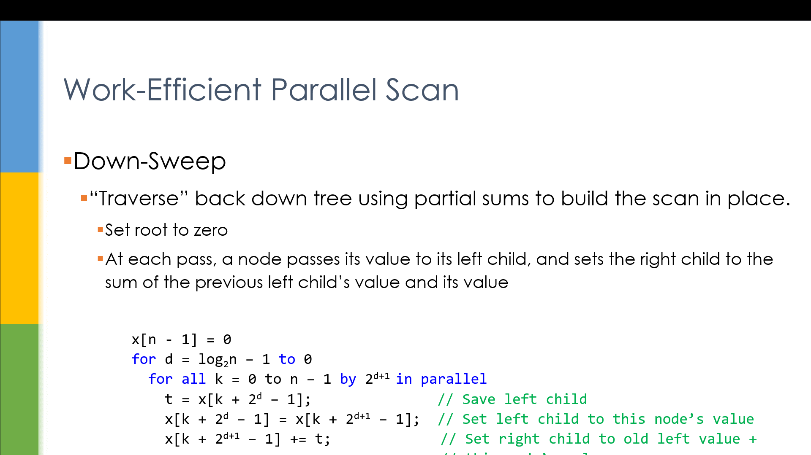
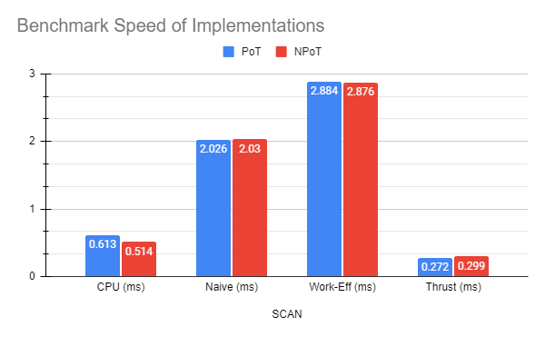

Project 2 CUDA Stream Compaction
======================

**University of Pennsylvania, CIS 565: GPU Programming and Architecture, Project 2**

* Raymond Yang
	* [LinkedIn](https://www.linkedin.com/in/raymond-yang-b85b19168)
	* Tested on: 
		* 09/21/2021
		* Windows 10
		* NVIDIA GeForce GTX 1080 Ti. 
	* Submitted on: 09/21/2021

## Introduction 
The objective of this assignment was to implement Stream Compaction. Stream compaction involves three main processes: 
* Boolean Mapping: Given an input array of data `idata`, this data must first be mapped to a boolean array `dev_bool`. This boolean array evaluates whether that input data at each index is desireable. If so, the data will be kept during Scatter. If not, the data will be removed during Scatter. 
* Scan: Given an input boolean array `dev_bool`, scan will output a prefix sum of array values. This output array `dev_dataPadded` should match the format of an exclusive scan. This output array contains the indices of where desirable values in the original input data will be stored during Scatter.

  

* Scatter: Given `dev_bool` and `dev_dataPadded`, Scatter will output a final array `dev_odata` that contains only desirable values. 

### CPU Implementation
`stream_compaction/cpu.cu` implements scan and scatter on the host machine without interacting with the GPU. This implementation follows a simple for loop that iterates through the input data. The output of our CPU implementation becomes the baseline for comparison with respect to time performance and output accuracy of Naive and Work Efficient. 

### Naive Implementation
`stream_compaction/naive.cu` implements a naive approach to scan. This process is "embarassingly parallel" and attempts to perform scan by taking advantage of parallelism. The approach is theoretically `O(log n)` efficient with respect to input data size. Input values at different strides are paired and summed and returned to the input array. This approach is repeated `log n` times. Current implementation does not take advantage of any optimizations to improve performance. 

  

### Work Efficient Implementation 
`stream_compaction/efficient.cu` implements a work-efficient approach to scan and compact. The scan process is broken into two parts: 
* Upsweep: 

  

* Downsweep:

  

## Data Analysis 
Benchmark was run on 3 implementations (CPU, Naive, Work-Eff) and the Thrust API. Benchmarks were recorded after 10 successive runs. Benchmarks were recorded in milliseconds. Benchmarks were ran on two data sets. The first data set (PoT = Power of Two) is an array of size 220 populated by random values. The second data set (NPoT = Not Power of Two) is an array of size 220 - 3 populated by random values. 

| SCAN | CPU (ms) | Naive (ms) | Work-Eff (ms) | Thrust (ms) |
|------|----------|------------|---------------|-------------|
| PoT  | 0.613    | 2.026      | 2.884         | 0.272       |
| NPoT | 0.514    | 2.030      | 2.876         | 0.299       |

  

## Limitation of Current Design
Implementations failed to take advantage of additional optimizations specified by <a href="/INSTRUCTION.md">instructions</a>
These include: 
* [Optimizing thread and block usage](https://github.com/CIS565-Fall-2021/Project2-Stream-Compaction/blob/main/INSTRUCTION.md#part-5-why-is-my-gpu-approach-so-slow-extra-credit-5).
* [Utilizing shared memory to drastically reduce memory read and write time](https://github.com/CIS565-Fall-2021/Project2-Stream-Compaction/blob/main/INSTRUCTION.md#part-7-gpu-scan-using-shared-memory--hardware-optimizationextra-credit-10). 