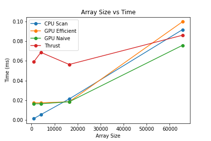

<p align="center">
  <h1 align="center">Prefix Sum and Stream Compaction</h2>
  <h2 align="center">Author: (Charles) Zixin Zhang</h2>
  <p align="center">
    CPU and GPU Implementations of Exclusive Prefix Sum(Scan) Algorithm and Stream Compaction in CUDA C
  </p>
</p>

---

I would like to extend project 2 by one day, please. 

## Features

- CPU Scan & Stream Compaction
- Naive GPU Scan Algorithm Using Shared Memory
- Work-Efficient GPU Scan Using Shared Memory & Stream Compaction
- Thrust's Scan Algorithm

For all GPU Scan algorithms, I choose to implement inclusive Scan first, and then convert the result of inclusive Scan to exclusive Scan. This can be done in parallel with minimal code. 

## Performance Analysis



When the array size is under 20,000, CPU Scan performs better than other algorithms. As the array size increases, GPU Naive Scan performs better than the rest of the algorithms. The Thrust implementation has more stable performance than the rest of the algorithms. 

Output when array size is 65536:

```
 [SM 8.6 NVIDIA GeForce RTX 3080]
 Max threads per block: 1024
 Shared memory per block: 49152 bytes
 Max threads per SM: 1536
 Max blocks per SM: 16
 Max grid size: 2147483647, 65535, 65535
****************
** SCAN TESTS **
****************
    [  27  40   6  30  21  41  41  26  20   5   6  29  41 ...  32   0 ]
==== cpu scan, power-of-two ====
   elapsed time: 0.0972ms    (std::chrono Measured)
    [   0  27  67  73 103 124 165 206 232 252 257 263 292 ... 1599954 1599986 ]

==== cpu scan, non-power-of-two ====
   elapsed time: 0.085ms    (std::chrono Measured)
    [   0  27  67  73 103 124 165 206 232 252 257 263 292 ... 1599856 1599858 ]
    passed

==== work-efficient scan, power-of-two ====
   elapsed time: 0.178144ms    (CUDA Measured)
    passed
==== work-efficient scan, non-power-of-two ====
   elapsed time: 0.096544ms    (CUDA Measured)
    passed
==== naive scan, power-of-two ====
   elapsed time: 0.091232ms    (CUDA Measured)
    passed
==== naive scan, non-power-of-two ====
   elapsed time: 0.182464ms    (CUDA Measured)
    passed
==== thrust scan, power-of-two ====
   elapsed time: 0.10432ms    (CUDA Measured)
    [   0  27  67  73 103 124 165 206 232 252 257 263 292 ... 1599954 1599986 ]
    passed
==== thrust scan, non-power-of-two ====
   elapsed time: 0.075776ms    (CUDA Measured)
    [   0  27  67  73 103 124 165 206 232 252 257 263 292 ... 1599856 1599858 ]
    passed

*****************************
** STREAM COMPACTION TESTS **
*****************************
    [   0   1   0   1   3   3   2   1   0   1   2   1   2 ...   3   0 ]
==== cpu compact without scan, power-of-two ====
   elapsed time: 0.1293ms    (std::chrono Measured)
    [   1   1   3   3   2   1   1   2   1   2   2   1   3 ...   3   2 ]
    passed
==== cpu compact without scan, non-power-of-two ====
   elapsed time: 0.1319ms    (std::chrono Measured)
    [   1   1   3   3   2   1   1   2   1   2   2   1   3 ...   3   3 ]
    passed
==== cpu compact with scan ====
   elapsed time: 0.6768ms    (std::chrono Measured)
    [   1   1   3   3   2   1   1   2   1   2   2   1   3 ...   3   2 ]
    passed
==== work-efficient compact, power-of-two ====
   elapsed time: 0.096544ms    (CUDA Measured)
    [   1   1   3   3   2   1   1   2   1   2   2   1   3 ...   3   2 ]
    passed
==== work-efficient compact, non-power-of-two ====
   elapsed time: 0.096544ms    (CUDA Measured)
    [   1   1   3   3   2   1   1   2   1   2   2   1   3 ...   3   3 ]
    passed
Press any key to continue . . .
```


### Block Size

RTX 3080 Stats: 

```
 [SM 8.6 NVIDIA GeForce RTX 3080]
 Max threads per block: 1024
 Shared memory per block: 49152 bytes
 Max threads per SM: 1536
 Max blocks per SM: 16
 Max grid size: 2147483647, 65535, 65535
```

I want to choose a block configuration that would result in the largest number of threads in the SM. 

:heavy_check_mark: 512 threads per block

- You need 1536/512 = 3 blocks to fully occupy the SM. Fortunately, SM allows up to 16 blocks. Thus, the actual number of threads that can run on this SM is 3  * 512 = 1536. We have occupied 1536/1536 = 100% of the SM. 

## Naive Scan 

- Implemented ```NaiveGPUScan``` using shared memory. 
- Each thread is assigned to evolve the contents of one element in the input array. 
- This is largely a four step process: 
  - compute the scan result for individual sections. Then, store their block sum to ```sumArray```
  - scan block sums
  - add scanned block sum ```i``` to all values of scanned block ```i + 1```
  - convert from inclusive to exclusive scan

In my implementation, the naive kernel can process up to 128 elements in each section by using 128 threads in each block. If the input data consists of 1,000,000 elements, we can use ceil(1,000,000  / 128) = 7813 thread blocks. With up to 2147483647 thread blocks in the x-dimension of the grid, the naive kernel can process up to 2147483647 * 128 = around 274 billion elements. 

## Work Efficient Scan

Understand thread to data mapping:

```int index = (threadIdx.x + 1) * stride * 2 - 1;```

- (threadIdx.x + 1) shifts thread indices from 0, 1, 2, 3, ... to 1, 2, 3, 4, ...All indices become non-zero integers. 
- (threadIdx.x + 1) * stride * 2 - 1
  - For example, when stride = 1, we want thread 0 maps to data index [1], thread 1 maps to data index[3], etc. 
    - (threadIdx.x + 1) * stride * 2 - 1 = (0 + 1) * 1 * 2 - 1 = 1
    - (threadIdx.x + 1) * stride * 2 - 1 = (1 + 1) * 1 * 2 - 1 = 3
  - For example, when stride = 2, we want thread 0 maps to data index [3], thread 1 maps to data index[7], etc. 
    - (threadIdx.x + 1) * stride * 2 - 1 = (0 + 1) * 2 * 2 - 1 = 3
    - (threadIdx.x + 1) * stride * 2 - 1 = (1 + 1) * 2 * 2 - 1 = 7


## Bloopers

### #1

```
CUDA error (d:\dev\565\project2-stream-compaction\stream_compaction\naive.cu:84): memCpy back failed!: an illegal memory access was encountered

83            cudaMemcpy(odata, d_OutputData, size, cudaMemcpyDeviceToHost);
84            checkCUDAError("memCpy back failed!");
```

- I encountered this error when implementing the naive version (without considering arbirary-length inputs) of the scan algorithm. At first, I suspected the culprit is on line 83 (because the line 84 reports the error). However, the culprit actually resides in my ```kernNaiveGPUScan``` function where I accessed ```XY[-1]``` inside the for loop. 
- Fix: Need a if-statement to make sure we never access```XY[-1]```. Also need to make sure ```__syncthreads()``` are **not** in the if-statement. 

> When a ```__syncthread()``` statement is placed in an if-statement, either all or none of the threads in a block execute the path that includes the __syncthreads(). PMPP p.59

## Note

- CPU sequential scan algorithms are linear algorithms and are extremely work-efficient. 
- Expected speed:  Thrust > GPU Efficient(Brent Kung) >= CPU > Naive GPU (koggle stone)
  - Why is Naive GPU slower than CPU ?
    - Naive GPU has control divergence in the first warp. Performance hit is worse for smaller block size.
    - Naive GPU is not work-efficient. Naive GPU has NlogN - (N - 1), whereas CPU has only (N - 1)

