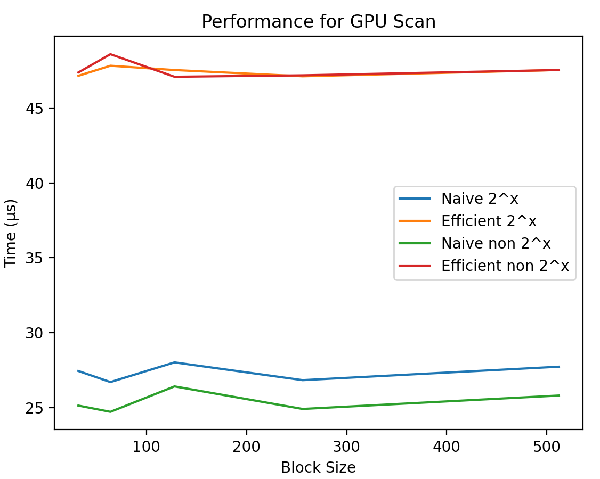
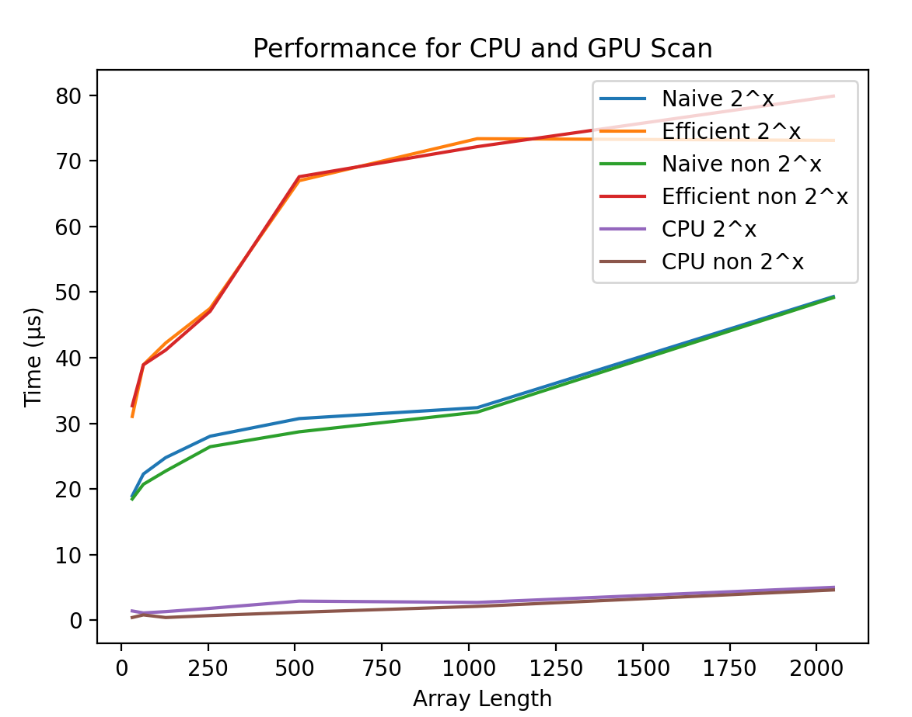

CUDA Stream Compaction
======================

**University of Pennsylvania, CIS 565: GPU Programming and Architecture, Project 2**

* Nuofan Xu
* Tested on: Windows 10, AMD Ryzen 3800x @ 3.9Hz 2x16GB RAM, RTX 2080 Super 8GB

#### Overview 

This project implements Scan and Stream Compaction and tests performance of various implementations with different array size and block size:

The implementations are shown as following (all implementations support Non-Power-Of-Two input):

*Scan 
    *cpu
    *naive (gpu)
    *work-efficient (gpu, optimized indexing)
    *thrust (gpu)
*Stream Compaction
    *cpu without scan
    *cpu with scan
    *gpu with work-efficient scan

### BlockSize Optimization
An rought optimazation attempt is done on the GPU block size. Through testing, changing blockSize does almost no effect on the performance the performance of Navie and efficient implmentation of scan and stream compaction with small input array size. In the case of big array size, block size does slightly affect the performance. There is no obvious pattern that purely increasing or decreasing block size would lead to a noticeable difference in performance, rather, there seem to be a sweet spot around blozk size 64 to 128. After consideration, bloci size of 128 is used for all the subsequent test results. The graph is plotted as following:

  
   

<!--  -->

### ArraySize Performance Analysis
Investigations have also been done on array size to see the performance of all implementations. The resulting plot is shown below. The cpu implementation is super fast for small arrays, as it has less in comparison to the parallelized versions on GPU. When the array size increases, the parallelization begin to manifest its power with complexity O(nlogn) for Navie and O(n) for efficient implemtation. This is as expected as depth of the calculations increases with the length of the array. 

### GPU Code Optimization
Several optimization attempts have been done to increase the performance on GPU.
* Reduce the number of steps that some threads need to go through.
Not all the threads need to go through the UpSweep and DownSweep part. Threads that are not involved in the process can be terminated early.

* Adjust the blockSize.
Block size in the GPU can be changed to allow a bigger number of threads running in the same block. No obvious effect is obeserved.

* Reduce the number of threads that need to be launched.
This is because not all threads are actually working. For example, if the input size is 1024, we only need 512 threads at most instead of 1024 for the first depth (the number of nodes in the addition tree is only half of the size).

Before those optimaztions, the performance of efficient scan and stream compaction is very low, even lower than the CPU implemention with complexity O(n^2). With 

### Thrust Libs
Scan and stream compaction is also implemented using thrust library. However, the speed of thrust scan is very slow. The reason behind that, in my opinion, is that these libraries, especially thrust, try to be as generic as possible and optimization often requires specialization: for example a specialization of an algorithm can use shared memory for fundamental types (like int or float) but the generic version can't. Thrust focuses on providing a generic template that can be easily used by all users and sacrifices speed for generalizability.

### Sample Test Result

Sample performance test result of input array size of 2^8 with blockSize of 128

### Feedback
Any feedback on errors in the above analysis or any other places is appreciated.