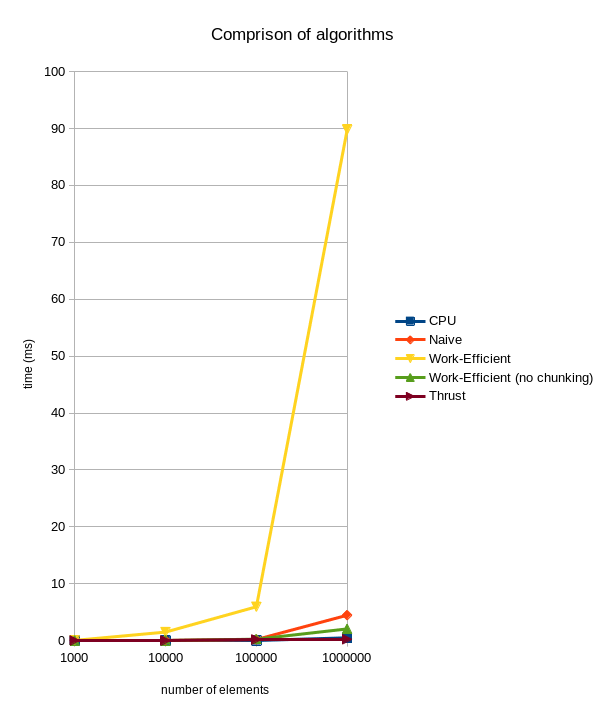

CUDA Stream Compaction
======================

**University of Pennsylvania, CIS 565: GPU Programming and Architecture, Project 2**

* Paul (San) Jewell
  * [LinkedIn](https://www.linkedin.com/in/paul-jewell-2aba7379), [work website](
    https://www.biociphers.org/paul-jewell-lab-member), [personal website](https://gitlab.com/inklabapp), [twitter](https://twitter.com/inklabapp), etc.
* Tested on: (TODO) Linux pop-os 5.11.0-7614-generic, i7-9750H CPU @ 2.60GHz 32GB, GeForce GTX 1650 Mobile / Max-Q 4GB 

### GPU scan and stream compaction demonstration

This repository contains some comparisons of basic algorithms compared between a CPU serial implementation, my GPU CUDA implementation, 
and similar functions provided by the 'thrust' library. 

I demonstrate usage of the naive, buffered, work-efficient, and chunked work-efficient scan algorithms as described in 
[this link](https://developer.nvidia.com/gpugems/gpugems3/part-vi-gpu-computing/chapter-39-parallel-prefix-sum-scan-cuda).
The implementation is also broken down into a number of sub-functions for easier comprehension by the curious reader. 

### Performance comparison overview

After manually testing a number of block sizes, I've found that a size of 64 works best for the efficient scan 
implementation. (same as for boids)and 512 (the largest I can do) works best for the naive implementation. (this 
pretty much makes sense as it is a largely processor-count-limited algorithm). Thrust does not allow specifying a 
manual block size that I could find so I didn't do any testing there. 



For a first iteration, I was unable to run larger sizes without causing OOM on my local machine
 (desktop completely crashed), so I tested up to 1mil only. Clearly something seems to have goofed in either 
 a single blocking line in my efficient implementation, or the measurement code location. I don't believe a simple
 inefficiency would lead to the huge discrepancy between naive and efficient implementations here. The no-chunking
 implementation should do the same amount of operations for the up and down sweep as the chunking implementation (ideal),
 however, it will get the incorrect result. There is something very inefficient with the chunking that I've not yet been 
 able to work out.

```
  ****************
  ** SCAN TESTS **
  ****************
      [  29  18  29  17  11   3  19  31   3  49  25  31  31 ...  14   0 ]
  ==== cpu scan, power-of-two ====
     elapsed time: 0.000686ms    (std::chrono Measured)
      [  29  47  76  93 104 107 126 157 160 209 234 265 296 ... 23987 23987 ]
  ==== cpu scan, non-power-of-two ====
     elapsed time: 0.000377ms    (std::chrono Measured)
      [  29  47  76  93 104 107 126 157 160 209 234 265 296 ... 23950 23960 ]
      passed 
  ==== naive scan, power-of-two ====
     elapsed time: 0.060032ms    (CUDA Measured)
      [  29  47  76  93 104 107 126 157 160 209 234 265 296 ... 23987 23987 ]
  ==== naive scan, non-power-of-two ====
     elapsed time: 0.055296ms    (CUDA Measured)
      [  29  47  76  93 104 107 126 157 160 209 234 265 296 ... 23950 23960 ]
      passed 
  ==== work-efficient scan no chunk, power-of-two ====
     elapsed time: 0.087648ms    (CUDA Measured)
      [  29  47  76  93 104 107 126 157 160 209 234 265 296 ... 23987 23987 ]
      passed 
  ==== work-efficient scan no chunk, non-power-of-two ====
     elapsed time: 0.041152ms    (CUDA Measured)
      [  29  47  76  93 104 107 126 157 160 209 234 265 296 ... 23950 23960 ]
      passed 
  ==== work-efficient scan, power-of-two ====
     elapsed time: 0.04512ms    (CUDA Measured)
      [  29  47  76  93 104 107 126 157 160 209 234 265 296 ... 23987 23987 ]
      passed 
  ==== work-efficient scan, non-power-of-two ====
     elapsed time: 0.058752ms    (CUDA Measured)
      [  29  47  76  93 104 107 126 157 160 209 234 265 296 ... 23950 23960 ]
      passed 
  ==== thrust scan, power-of-two ====
     elapsed time: 0.022528ms    (CUDA Measured)
      [  29  47  76  93 104 107 126 157 160 209 234 265 296 ... 23987 23987 ]
      passed 
  ==== thrust scan, non-power-of-two ====
     elapsed time: 0.021024ms    (CUDA Measured)
      [  29  47  76  93 104 107 126 157 160 209 234 265 296 ... 23950 23960 ]
      passed 
  
  *****************************
  ** STREAM COMPACTION TESTS **
  *****************************
      [   1   2   1   3   1   1   3   1   3   3   3   3   3 ...   0   0 ]
      [   1   2   1   3   1   1   3   1   3   3   3   3   3 ...   2   2 ]
  ==== cpu compact without scan, power-of-two ====
     elapsed time: 0.002584ms    (std::chrono Measured)
      [   1   2   1   3   1   1   3   1   3   3   3   3   3 ...   2   3 ]
      passed 
  ==== cpu compact without scan, non-power-of-two ====
     elapsed time: 0.001953ms    (std::chrono Measured)
      [   1   2   1   3   1   1   3   1   3   3   3   3   3 ...   2   2 ]
      passed 
  ==== cpu compact with scan ====
     elapsed time: 0.004194ms    (std::chrono Measured)
      [   1   2   1   3   1   1   3   1   3   3   3   3   3 ...   2   3 ]
      passed 
  ==== cpu compact with scan, non-power-of-two ====
     elapsed time: 0.003411ms    (std::chrono Measured)
      [   1   2   1   3   1   1   3   1   3   3   3   3   3 ...   2   2 ]
      passed 
  ==== work-efficient compact, power-of-two ====
     elapsed time: 0.065216ms    (CUDA Measured)
      [   1   2   1   3   1   1   3   1   3   3   3   3   3 ...   2   3 ]
      passed 
  ==== work-efficient compact, non-power-of-two ====
     elapsed time: 0.063552ms    (CUDA Measured)
      [   1   2   1   3   1   1   3   1   3   3   3   3   3 ...   2   2 ]
      passed 
  sh: 1: pause: not found
  
  Process finished with exit code 0
```