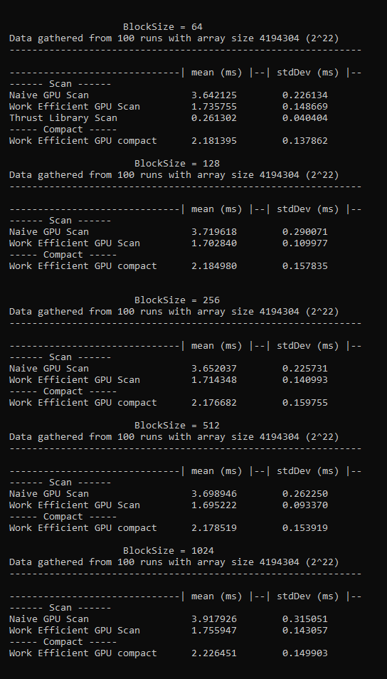

CUDA Stream Compaction
======================

**University of Pennsylvania, CIS 565: GPU Programming and Architecture, Project 2**

* Matt Elser
  * [LinkedIn](https://www.linkedin.com/in/matt-elser-97b8151ba/), [twitter](twitter.com/__mattelser__)
* Tested on: Tested on: Ubuntu 20.04, i3-10100F @ 3.6GHz 16GB, GeForce 1660 Super 6GB

### Main Features
This project implements an exclusive scan (performing an operation on (in this case a sum of) all previous 
elements along an array) and stream compaction (removing elements from an array based on a condition) using 
the CPU, GPU with CUDA, and the CUDA powered library `Thrust`. 
- all required algorithms work
- Efficient scan and compaction are faster than CPU implementation for arrays of sufficient size
- Radix sort has been implemented (without tiling or bitonic merge)

### Time Comparison
The test setup in `main.cpp` has been coopted to set up repeated timings to remove noise from measurements.

CPU scan and compact may be faster for smaller arrays, but the efficient GPU algorithms become more efficient 
at array size 2^16^ for compact and 2^17^ for efficient scan. 

### Block Size Comparison
changing the number of threads per blocks did not have a noticeable impact on timing. Minor differences are 
can be seen in the tables below, but almost all are around one standard deviation of another, so this may just
be noise.

### Known limitations
- [FIXED] The Naive implementation fails for array sizes greater than 2^25^. 
  - Naive was calling an inefficient number of threads, leading to higher-than needed `threadIdx.x` 
    values. When multiplied to get the `index` this overflowed int and yielded a negative index.
    Logic around indices (reasonably) assumed positive values and therefore caused an out of bounds write.
- compact scan fails for array sizes greater than 2^28^ due to running out of CPU memory on the (16Gb) test machine.

### Extra Credit
- Work Efficient GPU algorithms are more efficient than CPU (for large array sizes). This was achieved 
  by removing divergent threads from `upsweep` and `downsweep` kernel calls. Prior to the discussion in class of
  modifying the indexing for optimal thread scheduling, these algorithms were implemented to acheive the same end 
  iteratively. Each layer is a separate kernel call, and each kernel call only spawns one thread per index being 
  written to (i.e. n/2 for the first call, n/4 for the next, etc.). This does not have the same benefit of contiguous 
  memory reads, however. Of note, this iterative method does simplify syncing of threads/kernels. No threads on any 
  given layer are reading/writing from/to any of the indices being read/written from/to by any other thread. Since 
  All layers are separate kernel calls (on the default stream and therefore with an implicit join/sync), so no 
  explicit syncs are needed. 
- Radix sort has been implemented, though without tiling or bitonic merge. It sorts correctly for all array sizes (power of two 
  and non-power of two) up until 2^27, at which point the test machine runs out of memory. Radix sorting has been 
  validated against `Thrust`'s sort (though the timing of the two are different by several orders of magnitude). 
  The algorithm has not been optimized to use shared memory or contiguous memory reads, and would fail for arrays with
  negative values. 
