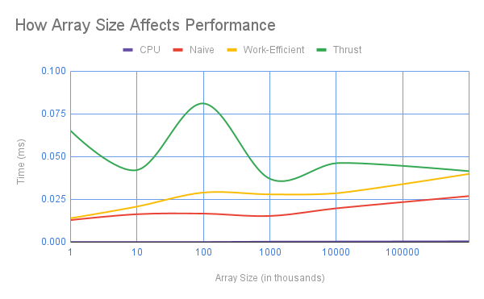

CUDA Stream Compaction
======================

**University of Pennsylvania, CIS 565: GPU Programming and Architecture, Project 2**

* Ashley Alexander-Lee
  * [LinkedIn](linkedin.com/in/asalexanderlee), [Personal Website](https://asalexanderlee.myportfolio.com/)
* Tested on: Windows 10, i7-6700 @ 3.40GHz 16GB, Quadro P1000 (Moore 100A Lab)

### Project Description
This project involved practice writing parallel algorithms in Cuda, chiefly scan, reduction, and compaction. For comparison, I wrote algorithms on the CPU, as well as naive and work-efficient methods that leverage the GPU.

#### Parallel Reduction
Parallel reduction is an algorithm by which you can add all of the numbers in an array, in parallel. You can achieve this by adding pairs of numbers, looping through the algorithm log(n) times, where n is the size of the array.

<p align="left">
  
</p>

#### Scan (Prefix Sums)
A scan of an array produces an array where each element represents a sum of the elements that came before it. This algorithm involves adding numbers based on a logarithmic offset, as illustrated below. The last element in the array will represent the reduction. Below is an illustration of a naive parallel scan algorithm, which runs in O(log(n)) time. 


We can improve upon this algorithm by doing scan in two steps: 1) parallel reduction, and 2) calculation of partial sums to finish the scan. The parallel reduction occurs as described above. The calculation of partial sums works as illustrated below: 


#### Compaction
Compaction involves taking an array of values and returning an array filled with only the values that are "truthy". You can do this by performing the following steps:

1. Convert all "truthy" values to 1s and all others to 0s
2. Perform scan on the resulting array. The result of scan should give you the desired indices in the output compact array for all true values 
3. Use the indices to write the true values to a compact array

### Performance Analysis

**Array Size vs. Scan Performance**

Below I've charted how each of the scan algorithms perform side-by-side. The CPU algorithm should run in O(n) time, since it must read every element. The naive and work-efficient algorithms should both run in logarithmic time -- the graph mirrors that below. Note that, since the x-axis uses logarithmic scale, a logarithmic function will appear linear. 



The work-efficient and naive algorithms perform better than the thrust implementation. I imagine this is due to two optimizations:

1. For each loop iteration, I halve the number of threads used to call the kernel -- that way, only threads that will do meaningful work are spawned. For example, if there are 8 elements in an array, I spawn 4 threads during the first loop, 2 during the second, and 1 during the last. If we do the math, we see that much fewer threads are spawned:

    | Iteration | Threads (unoptimized) | Threads (optimized) |
    | --------- | --------------------- | ------------------- |
    | 1 | 8 | 4 |
    | 2 | 8 | 2 |
    | 3 | 8 | 1 |
    | total | 24 | 7 |

2. I pre-computed the `pow()` operations before calling the kernels, which more than halved the runtime. I show the major results in a later section.

I'll also note that the work-efficient method is more predictable than the thrust method. As you can see from the chart, thrust runtimes are often unpredictable, and can, for example, run in 0.035ms OR 0.115ms given the same number of elements. I imagine the thrust method involves some sort of sort to move the "truthy" values to the front, which could explain the vastly different runtimes, since sort algorithms can have vastly different best and worst-case runtimes based on whether the array is already sorted. 

**Block Size vs. Scan Performance**


I did not notice a significant change in runtime given different block sizes. I imagine this is due to the fact I am using global memory, instead of shared memory. If I was using shared memory, only one block could be used to run a kernel at a time, since all threads access the same shared memory. Therefore, the block size would change how elements it could process in parallel at once. However, since I utilize global memory, the threads don't depend on each other, so block size doesn't impact the performance.

The block size 256 seems to optimize performance best.

### Bottlenecks
There are a few bottlenecks I noticed, especially in the compaction algorithm. 

1. The major roadblock is memory I/O. I am using global memory, which is very slow, and I have to copy data from device to host and allocate a device array in the compaction algorithm. If I reworked the code so that it used shared memory and cut out the device pointer as a middleman, it would be much faster. 
2. The threads are regularly accessing memory non-contiguously, leading to a lot of overhead time fetching data.
3. On the naive algorithm, there is a lot of branching in the kernel, meaning a number of threads are waiting for other threads to finish their execution. 

### Improving Scan Performance
I wanted to understand why my GPU scan implementations were running so horribly, so I decided to time the reduction and partial sum kernels in the work-efficient algorithm. On an input of 1^8, each kernel was taking about 0.05ms to run. In the interest of improving those times, I performed the `pow()` calculations outside of the kernel and passed them in as parameters, since I realized it was likely a costly operation that I only needed to perform once per kernel call. After removing the `pow()` operations, I more than halved the runtime for both kernels, improving the overall runtime so much that it now regularly outperforms the thrust implementation. I also made this change to my naive implementation, and saw similar gains. You can see some side-by-side comparisons below (tested on array size 1^8).

| Function | Previous Runtime | Improved Runtime|
| -------- | ---------------- | ---------------- |
| Reduction (Up-Sweep) | 0.06 | 0.016|
| Partial Sums (Down-Sweep) | 0.058 | 0.017 |
| Work-Efficient Scan | 0.1157 | 0.035 |
| Naive Scan | 0.0563 | 0.0245 |

You can see the huge change in made in performance by comparing the charted performance before the `pow()` removals and after.

**Previous Scan Performance**


**Scan Performance After Improvements**


### Sample Output

```****************
** SCAN TESTS **
****************
    [  31   2  26  37  46  20  20   8  38  37  28  41  20 ...   5   0 ]
==== cpu scan, power-of-two ====
   elapsed time: 0.0005ms    (std::chrono Measured)
    [   0  31  33  59  96 142 162 182 190 228 265 293 334 ... 6434 6439 ]
==== cpu scan, non-power-of-two ====
   elapsed time: 0.0004ms    (std::chrono Measured)
    [   0  31  33  59  96 142 162 182 190 228 265 293 334 ... 6357 6369 ]
    passed
==== naive scan, power-of-two ====
   elapsed time: 0.018432ms    (CUDA Measured)
    [   0  31  33  59  96 142 162 182 190 228 265 293 334 ... 6434 6439 ]
    passed
==== naive scan, non-power-of-two ====
   elapsed time: 0.018432ms    (CUDA Measured)
    [   0  31  33  59  96 142 162 182 190 228 265 293 334 ...   0   0 ]
    passed
==== work-efficient scan, power-of-two ====
   elapsed time: 0.039936ms    (CUDA Measured)
    [   0  31  33  59  96 142 162 182 190 228 265 293 334 ... 6434 6439 ]
    passed
==== work-efficient scan, non-power-of-two ====
   elapsed time: 0.032768ms    (CUDA Measured)
    [   0  31  33  59  96 142 162 182 190 228 265 293 334 ... 6357 6369 ]
    passed
==== thrust scan, power-of-two ====
   elapsed time: 0.044224ms    (CUDA Measured)
    [   0  31  33  59  96 142 162 182 190 228 265 293 334 ... 6434 6439 ]
    passed
==== thrust scan, non-power-of-two ====
   elapsed time: 0.032032ms    (CUDA Measured)
    [   0  31  33  59  96 142 162 182 190 228 265 293 334 ... 6357 6369 ]
    passed

*****************************
** STREAM COMPACTION TESTS **
*****************************
    [   1   2   0   1   2   0   2   0   0   1   0   1   0 ...   3   0 ]
==== cpu compact without scan, power-of-two ====
   elapsed time: 0.0008ms    (std::chrono Measured)
    [   1   2   1   2   2   1   1   1   2   3   2   1   2 ...   2   3 ]
    passed
==== cpu compact without scan, non-power-of-two ====
   elapsed time: 0.0009ms    (std::chrono Measured)
    [   1   2   1   2   2   1   1   1   2   3   2   1   2 ...   3   1 ]
    passed
==== cpu compact with scan ====
   elapsed time: 0.0012ms    (std::chrono Measured)
    [   1   2   1   2   2   1   1   1   2   3   2   1   2 ...   2   3 ]
    passed
==== work-efficient compact, power-of-two ====
   elapsed time: 0.22016ms    (CUDA Measured)
    [   1   2   1   2   2   1   1   1   2   3   2   1   2 ...   2   3 ]
    passed
==== work-efficient compact, non-power-of-two ====
   elapsed time: 0.257024ms    (CUDA Measured)
    [   1   2   1   2   2   1   1   1   2   3   2   1   2 ...   3   1 ]
    passed
```

