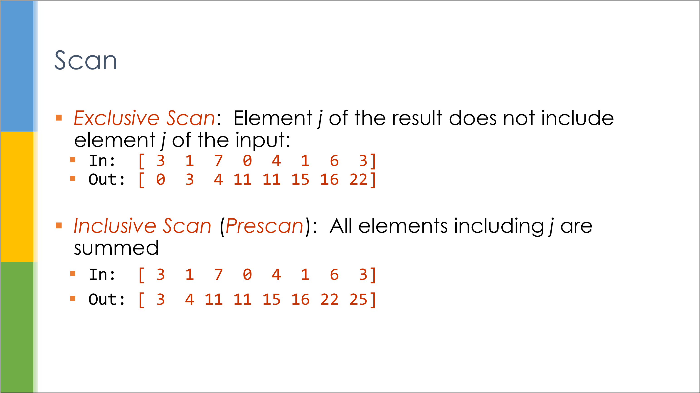
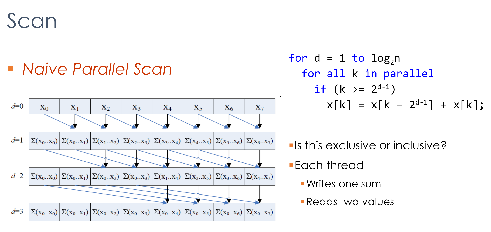
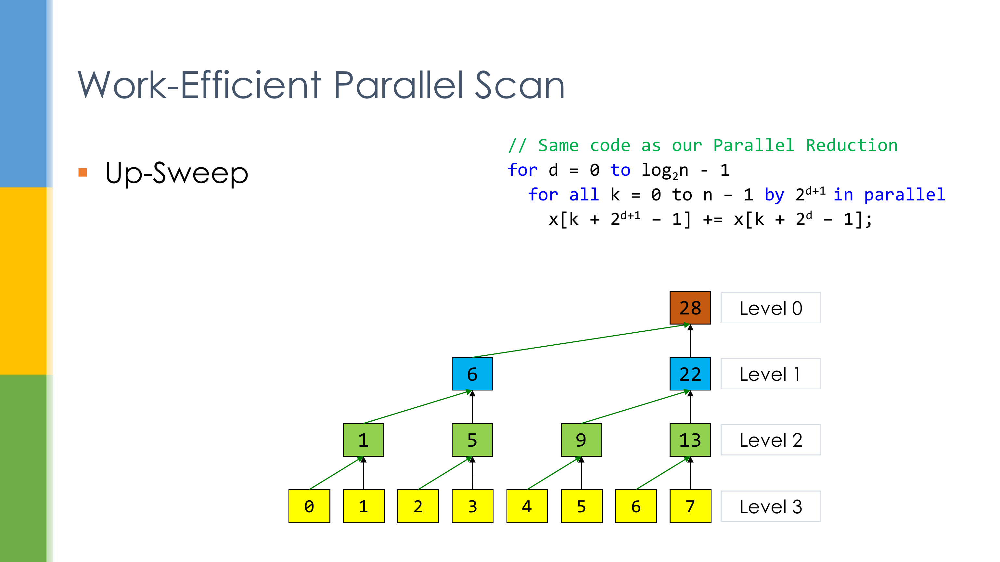
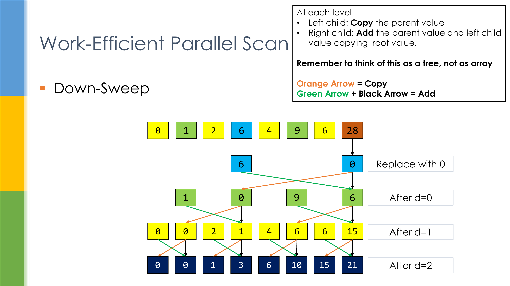
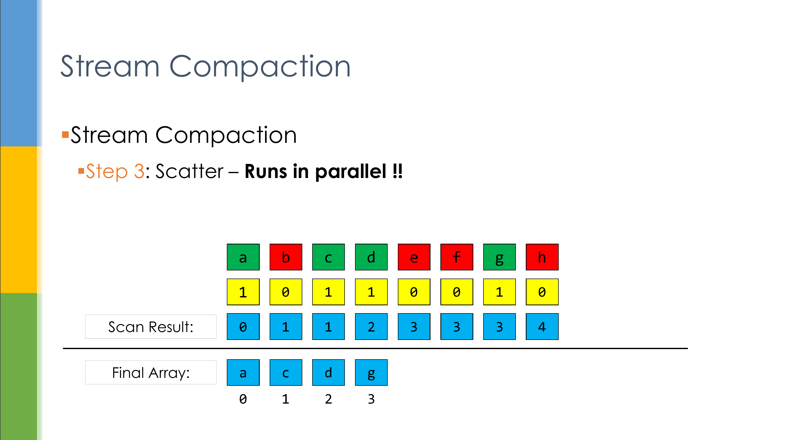

CUDA Stream Compaction
======================

**University of Pennsylvania, CIS 565: GPU Programming and Architecture, Project 2**

* Zhihao Ruan (ruanzh@seas.upenn.edu)
  * [LinkedIn](https://www.linkedin.com/in/zhihao-ruan-29b29a13a/), [personal website](https://zhihaoruan.xyz/)
* Tested on: Ubuntu 20.04 LTS, Ryzen 3700X @ 2.22GHz 48GB, RTX 2060 Super @ 7976MB

## Highlights
This project implements:
- a naive parallel scan algorithm compatible with arbitrary sized input arrays;
- a work-efficient parallel scan algorithm compatible with arbitrary sized input arrays;
- a stream compaction algorithm built upon the work-efficient parallel scan compatible with arbitrary sized input arrays.

The GPU steam compaction algorithm is demonstrated to be over 4x faster than the CPU version.

A sample of test output on `block_size` = 1024, `array_size` = 2^27 **(max array possible on local GPU)**:
```
****************
** SCAN TESTS **
****************
    [   5  33  25  22  48  26  23  19  36  32   2  17  45 ...  22   0 ]
==== cpu scan, power-of-two ====
   elapsed time: 79.9027ms    (std::chrono Measured)
    [   0   5  38  63  85 133 159 182 201 237 269 271 288 ... -1006515866 -1006515844 ]
==== cpu scan, non-power-of-two ====
   elapsed time: 81.4093ms    (std::chrono Measured)
    [   0   5  38  63  85 133 159 182 201 237 269 271 288 ... -1006515949 -1006515918 ]
    passed 
==== naive scan, power-of-two ====
   elapsed time: 31.3315ms    (CUDA Measured)
    [   0   5  38  63  85 133 159 182 201 237 269 271 288 ... -1006515866 -1006515844 ]
    passed 
==== naive scan, non-power-of-two ====
   elapsed time: 24.8398ms    (CUDA Measured)
    [   0   5  38  63  85 133 159 182 201 237 269 271 288 ...   0   0 ]
    passed 
==== work-efficient scan, power-of-two ====
   elapsed time: 37.6307ms    (CUDA Measured)
    [   0   5  38  63  85 133 159 182 201 237 269 271 288 ... -1006515866 -1006515844 ]
    passed 
==== work-efficient scan, non-power-of-two ====
   elapsed time: 37.6407ms    (CUDA Measured)
    [   0   5  38  63  85 133 159 182 201 237 269 271 288 ... -1006515949 -1006515918 ]
    passed 
==== thrust scan, power-of-two ====
   elapsed time: 3.16525ms    (CUDA Measured)
    [   0   5  38  63  85 133 159 182 201 237 269 271 288 ... -1006515866 -1006515844 ]
    passed 
==== thrust scan, non-power-of-two ====
   elapsed time: 3.12653ms    (CUDA Measured)
    [   0   5  38  63  85 133 159 182 201 237 269 271 288 ... -1006515949 -1006515918 ]
    passed 

*****************************
** STREAM COMPACTION TESTS **
*****************************
    [   0   3   1   1   1   3   0   1   2   1   1   1   2 ...   3   0 ]
==== cpu compact without scan, power-of-two ====
   elapsed time: 250.09ms    (std::chrono Measured)
    [   3   1   1   1   3   1   2   1   1   1   2   2   2 ...   3   3 ]
    passed 
==== cpu compact without scan, non-power-of-two ====
   elapsed time: 247.095ms    (std::chrono Measured)
    [   3   1   1   1   3   1   2   1   1   1   2   2   2 ...   2   3 ]
    passed 
==== cpu compact with scan ====
   elapsed time: 886.643ms    (std::chrono Measured)
    [   3   1   1   1   3   1   2   1   1   1   2   2   2 ...   3   3 ]
    passed 
==== work-efficient compact, power-of-two ====
   elapsed time: 58.4025ms    (CUDA Measured)
    [   3   1   1   1   3   1   2   1   1   1   2   2   2 ...   3   3 ]
    passed 
==== work-efficient compact, non-power-of-two ====
   elapsed time: 48.5331ms    (CUDA Measured)
    [   3   1   1   1   3   1   2   1   1   1   2   2   2 ...   2   3 ]
    passed 
```

## Introduction: Stream Compaction
Stream compaction, essentially, is a technique that aims at removing elements from a list (aka. stream) that are not satisfied according to some criteria. For example, if we have a stream of integers `[1 2 3 2 1 5 23 4 0 0 3 4 2 0 3 8 0]` and we wish to remove "all elements that are 0" (aka. the *criteria*), we would get the remaining compact list `[1 2 3 2 1 5 23 4 3 4 2 3 8]`.

Stream compaction is widely used in rendering & ray tracing. Although it seems straightforward to implement stream compaction in the first place, it is actually non-trivial to implement it on GPU with some parallel algorithms so that its performance can be boosted. This project would discuss the method for parallel stream compaction, and its underlying necessary component &mdash; parallel scan algorithm.

**For more detailed description of the project, please refer to the [project instruction.](INSTRUCTION.md)**

## Parallel Scan
Parallel scan, aka. parallel prefix sum, is a task of generating a list of numbers in which each index is the sum of all elements that comes before this index. There are two types of parallel scan: *exclusive* scan and *inclusive scan*, where the former inserts 0 at the beginning of output and discards the total sum at the end of list, while the latter keeps the total sum at the end of list and does not introduce 0 at the beginning.



### Naive Parallel Scan
A naive algorithm of implementing parallel scan is shown as follows. For each iteration, part of the thread adds up two elements in the list, producing the final result after several iterations.



### Work Efficient Parallel Scan
There is also a much more efficient version of parallel scan, which involves 1) a list reduction, 2) a down-sweep. The list reduction can also be called as the "up-sweep" procedure, producing a total sum of the list with all partial sums in the middle. The down-sweep procedure exactly compensates those missing parts for the middle elements and completes the entire parallel scan.





## Parallel Stream Compaction
After solving the problem of parallel scan, we can now get to the real algorithm for parallel stream compaction. Essentially, an effective stream compaction procedure consists of the following:
1. Generate a boolean array marking the validity of each element. For elements to remove, mark as "0"; otherwise mark as "1".
2. Compute exclusive parallel scan on the boolean array.
3. Scatter the desired elements into the output array. If an element is marked as "1" in the boolean array, store it into the corresponding indexed parallel scan position in the output array.



