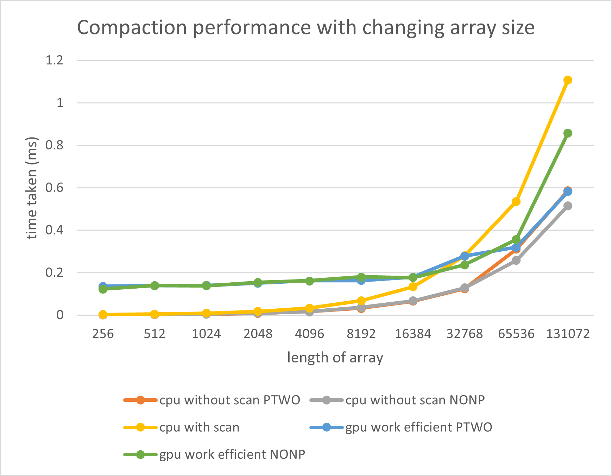

CUDA Stream Compaction
======================

**University of Pennsylvania, CIS 565: GPU Programming and Architecture, Project 2**

Beini Gu
  * [LinkedIn](https://www.linkedin.com/in/rgu/), [personal website](https://www.seas.upenn.edu/~gubeini/), [twitter](https://twitter.com/scoutydren), etc.
* Tested on: Windows 10, AMD Ryzen 7 3700X 8-Core Processor 3.59 GHz 16GB, GTX 2060

### GPU Scan and Stream Compaction

* Implementation of scan and stream compaction algorithms that runs parallel on GPU
* comparison between GPU and CPU performance on same stream compaction jobs. 
* TODO later: shared memory optimization

### Performance Analysis

* Runtime Output on array size 65536 ($2^{14}$) (See Appendix)

### Scan


* For scan, GPU computation I implemented lags behind CPU for all ranges of data. There is no clear difference between array size power of two or not. Since for CPU, the non-power-of-two array is just three elements less than its next-power-of-two. For GPU computation, we pad non-power-of-two arrays to power-of-twos. 

### Stream Compaction



* For a smaller length of the array, GPU computation lags behind all CPU computation. But for larger length of array, GPU computation becomes faster than stream compaction using "CPU with scan".
* Scan for CPU is not a good method since it does extra work computing prefix sum, etc while the CPU can just go through the entire array once for checking non-zeros (CPU without scan). 

### Reasons why this GPU approach is slow

* The most significant reason is because all computation takes use of the global memory in the GPU. Getting data from global memory is a very costly operation on GPU computation. 
* All the scan kernels involve parallel reduction algorithm which is not optimized for memory accessing. It's constantly accessing interleaved data which keep a lot of warps active. One way of optimizing is to use warp partitioning to retire warps early and to reduce number of divergent warps. 

### TODO: shared memory optimization

### Appendix

```
****************
** SCAN TESTS **
****************
    [  48   1  39  13  20   5   2  43  45  38   7  12  26 ...   9   0 ]
==== cpu scan, power-of-two ====
   elapsed time: 0.0315ms    (std::chrono Measured)
    [   0  48  49  88 101 121 126 128 171 216 254 261 273 ... 400910 400919 ]
==== cpu scan, non-power-of-two ====
   elapsed time: 0.0314ms    (std::chrono Measured)
    [   0  48  49  88 101 121 126 128 171 216 254 261 273 ... 400871 400878 ]
    passed
==== naive scan, power-of-two ====
   elapsed time: 0.075776ms    (CUDA Measured)
    [   0  48  49  88 101 121 126 128 171 216 254 261 273 ... 400910 400919 ]
    passed
==== naive scan, non-power-of-two ====
   elapsed time: 0.075776ms    (CUDA Measured)
    [   0  48  49  88 101 121 126 128 171 216 254 261 273 ...   0   0 ]
    passed
==== work-efficient scan, power-of-two ====
   elapsed time: 0.079904ms    (CUDA Measured)
    [   0  48  49  88 101 121 126 128 171 216 254 261 273 ... 400910 400919 ]
    passed
==== work-efficient scan, non-power-of-two ====
   elapsed time: 0.070592ms    (CUDA Measured)
    [   0  48  49  88 101 121 126 128 171 216 254 261 273 ... 400871 400878 ]
    passed
==== thrust scan, power-of-two ====
   elapsed time: 0.061312ms    (CUDA Measured)
    [   0  48  49  88 101 121 126 128 171 216 254 261 273 ... 400910 400919 ]
    passed
==== thrust scan, non-power-of-two ====
   elapsed time: 0.046496ms    (CUDA Measured)
    [   0  48  49  88 101 121 126 128 171 216 254 261 273 ... 400871 400878 ]
    passed

*****************************
** STREAM COMPACTION TESTS **
*****************************
    [   3   0   0   3   0   1   0   3   2   3   1   2   0 ...   3   0 ]
==== cpu compact without scan, power-of-two ====
   elapsed time: 0.0326ms    (std::chrono Measured)
    [   3   3   1   3   2   3   1   2   3   2   3   3   1 ...   1   3 ]
    passed
==== cpu compact without scan, non-power-of-two ====
   elapsed time: 0.0395ms    (std::chrono Measured)
    [   3   3   1   3   2   3   1   2   3   2   3   3   1 ...   1   2 ]
    passed
==== cpu compact with scan ====
   elapsed time: 0.0614ms    (std::chrono Measured)
    [   3   3   1   3   2   3   1   2   3   2   3   3   1 ...   1   3 ]
    passed
==== work-efficient compact, power-of-two ====
   elapsed time: 0.149408ms    (CUDA Measured)
    [   3   3   1   3   2   3   1   2   3   2   3   3   1 ...   1   3 ]
    passed
==== work-efficient compact, non-power-of-two ====
   elapsed time: 0.128736ms    (CUDA Measured)
    [   3   3   1   3   2   3   1   2   3   2   3   3   1 ...   1   2 ]
    passed
Press any key to continue . . .
```

