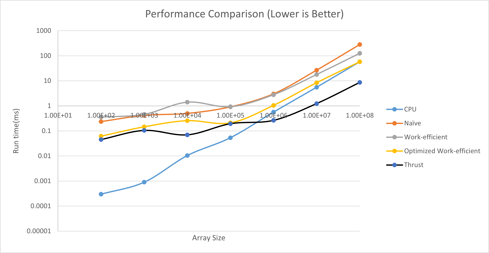
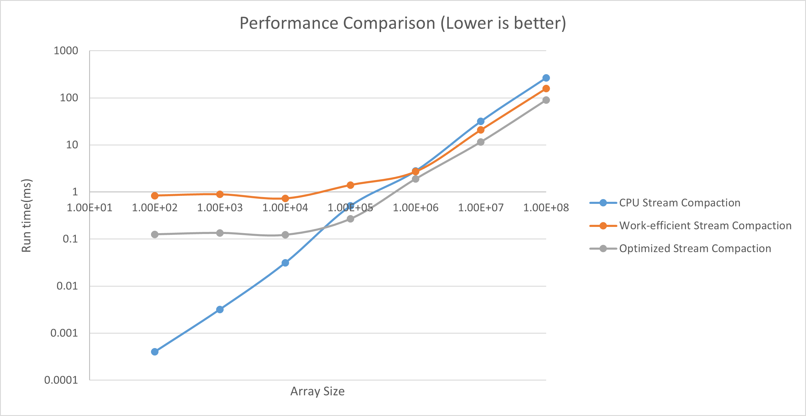

CUDA Stream Compaction
======================

**University of Pennsylvania, CIS 565: GPU Programming and Architecture, Project 2**

* Yuxuan Zhu
  * [LinkedIn](https://www.linkedin.com/in/andrewyxzhu/)
* Tested on: Windows 10, i7-7700HQ @ 2.80GHz 16GB, GTX 1050 4096MB (Personal Laptop)

**Introduction**

This project implemented different versions of the exclusive scanning algorithm and the stream compaction algorithm.
I implemented one CPU version of exclusive scanning and four GPU versions of exclusive scanning.

The CPU version of exclusive scanning supports in-place scanning operation by using local variables. It is surprisingly fast, even for
millions of elements.
The first GPU version of exclusive scanning is naive scanning, which iterativesly sums the array elements and does O(nlog n) computations.
The second GPU version of exclusive scanning is the work efficient version, which consists of an up-sweep portion and a down-sweep portion. I
launched different number of threads for each level of computation to reduce the number of "wasted" threads and improve performance.
The third GPU version is optimized based on the second version. I used shared memory to decrease the freqeuncy of global memory access. It is 
roughly twice as fast as the second version. It is also faster than the CPU version for larger arrays. This is considered extra credit.
The fourth GPU version is done by calling the thrust library. It is highly optimized and extremely fast for large arrays.

I also implemented two CPU versions of stream compaction and two GPU versions of stream compaction.
The first CPU version does stream compaction iteratively. It is quite fast.
The second CPU version simulates the stream compaction algorithm on a GPU by using scanning. It is a lot slower.
The first GPU version uses work efficient scanning to implement the stream compaction. It is quite fast.
The second GPU version uses the optimized work efficient scanning to implement stream compaction. It is also faster than the first version and often faster than
the CPU version.

**Performance Analysis**

I empirically found that the best block size is 256 for all versions of scan.



The graph above shows the performance comparsion among the different versions of the algorithm. The CPU version is almost always faster, unless the array
size is extremely large. The thrust library performance is always strictly better than my implementations. This is reasonable since I did not optimize everything due to
my current limited understanding of GPU performance. For example, I did not try to reduce bank conflicts. I don't know what's happening under the hood for the thrust version of scanning yet. I tried to analyze performance bottle necks of my algorithms by commenting out certain kernels and checking how much improvement in performance I get. For example, I realized the kernel that adds block increment to each element in a block is very slow due to frequent read/write of global memory. I optimized the code to use shared memory to improve the bottleneck.



The graph above shows the performance comparision among different versions of stream compaction algorithm. The CPU version was out-performed by my optimized GPU version when the array size is larger than 100000. 

Below is an attachment of the output of my test program.

```                                                                                                                        ****************                                                                                                        ** SCAN TESTS **                                                                                                        ****************                                                                                                            [  34  43  38  22   3  18  25  14  49  31  41  44  20 ...   9   0 ]                                                 ==== cpu scan, power-of-two ====                                                                                           elapsed time: 9.4994ms    (std::chrono Measured)                                                                         [   0  34  77 115 137 140 158 183 197 246 277 318 362 ... 244933885 244933894 ]                                     ==== cpu scan, non-power-of-two ====                                                                                       elapsed time: 6.9843ms    (std::chrono Measured)                                                                         [   0  34  77 115 137 140 158 183 197 246 277 318 362 ... 244933830 244933839 ]                                         passed                                                                                                              ==== naive scan, power-of-two ====                                                                                         elapsed time: 26.3491ms    (CUDA Measured)                                                                               [   0  34  77 115 137 140 158 183 197 246 277 318 362 ... 244933885 244933894 ]                                         passed                                                                                                              ==== naive scan, non-power-of-two ====                                                                                     elapsed time: 25.6866ms    (CUDA Measured)                                                                               [   0  34  77 115 137 140 158 183 197 246 277 318 362 ...   0   0 ]                                                     passed                                                                                                              ==== work-efficient scan, power-of-two ====                                                                                elapsed time: 18.4584ms    (CUDA Measured)                                                                               [   0  34  77 115 137 140 158 183 197 246 277 318 362 ... 244933885 244933894 ]                                         passed                                                                                                              ==== work-efficient scan, non-power-of-two ====                                                                            elapsed time: 17.1187ms    (CUDA Measured)                                                                               [   0  34  77 115 137 140 158 183 197 246 277 318 362 ... 244933830 244933839 ]                                         passed                                                                                                              ==== optimized work-efficient scan, power-of-two ====                                                                      elapsed time: 8.34717ms    (CUDA Measured)                                                                               [   0  34  77 115 137 140 158 183 197 246 277 318 362 ... 244933885 244933894 ]                                         passed                                                                                                              ==== optimized work-efficient scan, non-power-of-two ====                                                                  elapsed time: 7.95645ms    (CUDA Measured)                                                                               [   0  34  77 115 137 140 158 183 197 246 277 318 362 ... 244933830 244933839 ]                                         passed                                                                                                              ==== thrust scan, power-of-two ====                                                                                        elapsed time: 1.05674ms    (CUDA Measured)                                                                               [   0  34  77 115 137 140 158 183 197 246 277 318 362 ... 244933885 244933894 ]                                         passed                                                                                                              ==== thrust scan, non-power-of-two ====                                                                                    elapsed time: 1.1897ms    (CUDA Measured)                                                                                [   0  34  77 115 137 140 158 183 197 246 277 318 362 ... 244933830 244933839 ]                                         passed                                                                                                                                                                                                                                      *****************************                                                                                           ** STREAM COMPACTION TESTS **                                                                                           *****************************                                                                                               [   1   1   0   3   3   1   2   3   1   3   0   2   1 ...   3   0 ]                                                 ==== cpu compact without scan, power-of-two ====                                                                           elapsed time: 31.6402ms    (std::chrono Measured)                                                                        [   1   1   3   3   1   2   3   1   3   2   1   2   1 ...   2   3 ]                                                     passed                                                                                                              ==== cpu compact without scan, non-power-of-two ====                                                                       elapsed time: 28.173ms    (std::chrono Measured)                                                                         [   1   1   3   3   1   2   3   1   3   2   1   2   1 ...   3   2 ]                                                     passed                                                                                                              ==== cpu compact with scan ====                                                                                            elapsed time: 52.5519ms    (std::chrono Measured)                                                                        [   1   1   3   3   1   2   3   1   3   2   1   2   1 ...   2   3 ]                                                     passed                                                                                                              ==== work-efficient compact, power-of-two ====                                                                             elapsed time: 21.0639ms    (CUDA Measured)                                                                               [   1   1   3   3   1   2   3   1   3   2   1   2   1 ...   2   3 ]                                                     passed                                                                                                              ==== work-efficient compact, non-power-of-two ====                                                                         elapsed time: 20.3782ms    (CUDA Measured)                                                                               [   1   1   3   3   1   2   3   1   3   2   1   2   1 ...   3   2 ]                                                     passed                                                                                                              ==== optimized work-efficient compact, power-of-two ====                                                                   elapsed time: 11.0875ms    (CUDA Measured)                                                                               [   1   1   3   3   1   2   3   1   3   2   1   2   1 ...   2   3 ]                                                     passed                                                                                                              ==== optimized work-efficient compact, non-power-of-two ====                                                               elapsed time: 11.0332ms    (CUDA Measured)                                                                               [   1   1   3   3   1   2   3   1   3   2   1   2   1 ...   3   2 ]                                                     passed   ```                                                                
