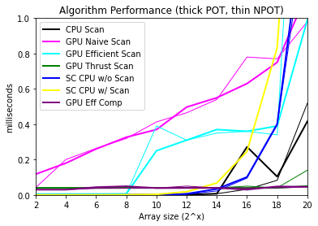

**University of Pennsylvania, CIS 565: GPU Programming and Architecture**
# Project 2 - CUDA Stream Compaction

* Jonas Oppenheim ([LinkedIn](https://www.linkedin.com/in/jonasoppenheim/), [GitHub](https://github.com/oppenheimj/), [personal](http://www.jonasoppenheim.com/))
* Tested on: Windows 10, Ryzen 9 5950x, 32GB, RTX 3080 (personal machine)

<a href="https://www.youtube.com/watch?v=7U3Oti2L8S4"></a>


## Introduction
This is the second project of my GPU Programming course at UPenn. The goal of this project was to implement two different algorithms both on the CPU and GPU and compare performance. Specifically, we were tasked with implementing the scan and stream compaction algorithms. Brief descriptions of both follow.

The [scan](https://en.wikipedia.org/wiki/Prefix_sum) algorithm involves summing array elements up to each index. For example, given array X=[x1, x2, ..., xn], the output would be [x1, x1+x2, x1+x2+x3, ..., x1+..+xn]. The two variations of this algorithm are _inclusive_ and _exclusive_ scan and the distinction between these variations is uninteresting. The stream compaction algorithm is essentially a high performance filter operation that is commonly used to remove zeros from an array. Stream compaction uses the scan algorithm as one of its steps. What these two algorithms have in common is that they are simple to understand, trivial to implement on the CPU, but _embarassingly parallel_, meaning that they're begging to be implemented on the GPU. The details underling both algorithms and their parallel implementations are provided in [Chapter 39 of GPU Gems 3](https://developer.nvidia.com/gpugems/gpugems3/part-vi-gpu-computing/chapter-39-parallel-prefix-sum-scan-cuda).

I implemented parts 1 - 4, and bonus part 7 using shared memory in the GPU Efficient Scan kernel.

The next section covers a performance overview of the various implementations and the final section contains my concluding thoughts about the assignment.

## Performance analysis
The plot below shows that as the problem size increases, most implementations take longer. The abrupt jump of some of the lines shows that most of the time taken by some algorithms is due to overhead instead of solving the problem. The Thrust library is clearly (and unsurprisingly) the most optimized. These tests were done with a block size of 256 becuase that seemed to work best up to 2^20.

It is seen that most of the GPU implementations are slower than the CPU equivalents. The two major GPU slowdowns that come to mind are a) copying data to the GPU with `cudamemcpy()` and accessing global memory inside the kernals, which was sometimes necessary. Clearly an optimized implementation on the GPU _far_ outperforms the CPU equivalent, since GPU Thrust does best.



Two things that made performance analysis difficult were that
- Efficient stream compaction (`Eff Comp`) used the efficient scan (`Efficient Scan`) code between its two kernels. I ended up only measuring the time it took to run the first kernel, `kernMapToBoolean`.
- Efficient scan (`Efficient Scan`) is a recursive algorithm with a lot of memory allocation at each recursive call. I ended up only measuring the duration of the kernels at the top level of recursion.

I would have liked to test arrays beyond 2^20 but I had a bug that I described on Piazza.
## Program output
```
****************
** SCAN TESTS **
****************
    [   8  18  44   9  36  16  44  17   6  39  36  19  10 ...  42   0 ]
==== cpu scan, power-of-two ====
   elapsed time: 0.0061ms    (std::chrono Measured)

==== cpu scan, non-power-of-two ====
   elapsed time: 0.007ms    (std::chrono Measured)
    passed

==== naive scan, power-of-two ====
   elapsed time: 0.591936ms    (CUDA Measured)
    passed

==== naive scan, non-power-of-two ====
   elapsed time: 0.576512ms    (CUDA Measured)
    passed

==== work-efficient scan, power-of-two ====

paddedN: 16384
grid size: 32
block size: 256

paddedN: 32
grid size: 1
block size: 16
   elapsed time: 0ms    (CUDA Measured)
    passed

==== work-efficient scan, non-power-of-two ====

paddedN: 16384
grid size: 32
block size: 256

paddedN: 32
grid size: 1
block size: 16
   elapsed time: 0ms    (CUDA Measured)
    passed

==== thrust scan, power-of-two ====
   elapsed time: 0.195584ms    (CUDA Measured)
    passed

==== thrust scan, non-power-of-two ====
   elapsed time: 0.041984ms    (CUDA Measured)
    passed


*****************************
** STREAM COMPACTION TESTS **
*****************************
    [   0   0   1   0   2   2   3   1   3   3   0   3   2 ...   2   0 ]
==== cpu compact without scan, power-of-two ====
   elapsed time: 0.0285ms    (std::chrono Measured)
    passed

==== cpu compact without scan, non-power-of-two ====
   elapsed time: 0.0255ms    (std::chrono Measured)
    passed

==== cpu compact with scan ====
   elapsed time: 0.0806ms    (std::chrono Measured)
    passed

==== work-efficient compact, power-of-two ====

paddedN: 16384
grid size: 32
block size: 256

paddedN: 32
grid size: 1
block size: 16
   elapsed time: 0.045056ms    (CUDA Measured)
    [   1   2   2   3   1   3   3   3   2   3   1   1   2 ...   1   2 ]
    passed

==== work-efficient compact, non-power-of-two ====

paddedN: 16384
grid size: 32
block size: 256

paddedN: 32
grid size: 1
block size: 16
   elapsed time: 0.041984ms    (CUDA Measured)
    [   1   2   2   3   1   3   3   3   2   3   1   1   2 ...   1   3 ]
    passed

Press any key to continue . . .
```

## Concluding thoughts
- The work-efficient parallel scan algorithm was the most complicated code I've ever written. While coding, I felt as though I was building a card castle in my mind and any distraction would knock it over and I'd have to start over. It just required a large mental cache in order to make progress. I'm proud of my solution, but there is an odd off-by-1 error (that I reported on Piazza) when n gets larger than 2^20, for certain block sizes. But my recursion and parallelism clearly work, even when the block size is 4 with 2^18 elements.
- I think that well-written CPU code is self-documenting; if you use descriptive variable and function names, and give each function a single purpose, then there is little need for code comments. I'm starting to believe that no matter how nicely written CUDA code is, it will always require comments for a future reader. With CPU code, I may sacrifice some performance for readability. With GPU code, I'm realizing that all readability is sacrificed for performance. Machine-efficient code is simply not readable.
- I think this may be a good assignment to start with because it allows us to discover clearly how to take a simple CPU algorithm and implement it on the GPU for maximum performance. Also, we were shown how there are many ways the algorithms can be optimized, but I was a little frustrated that that lecture was *the day before* this was due. I think we could get a lot out of spending time optimizing this algorithm.