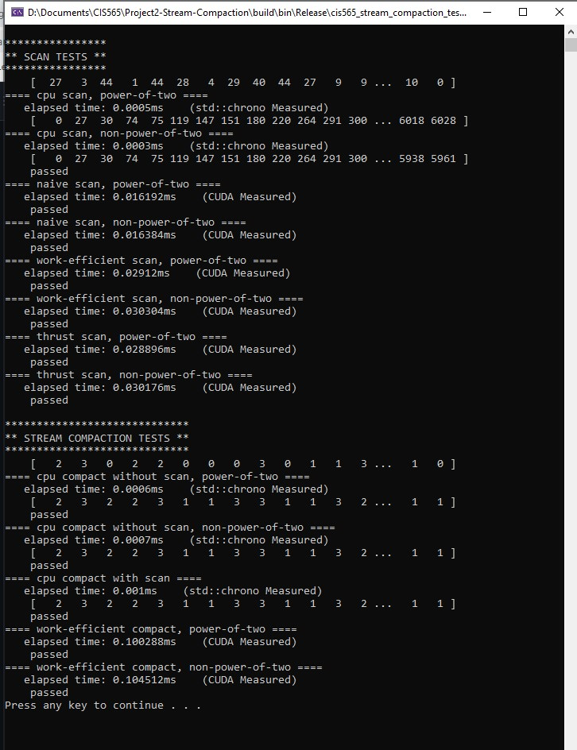
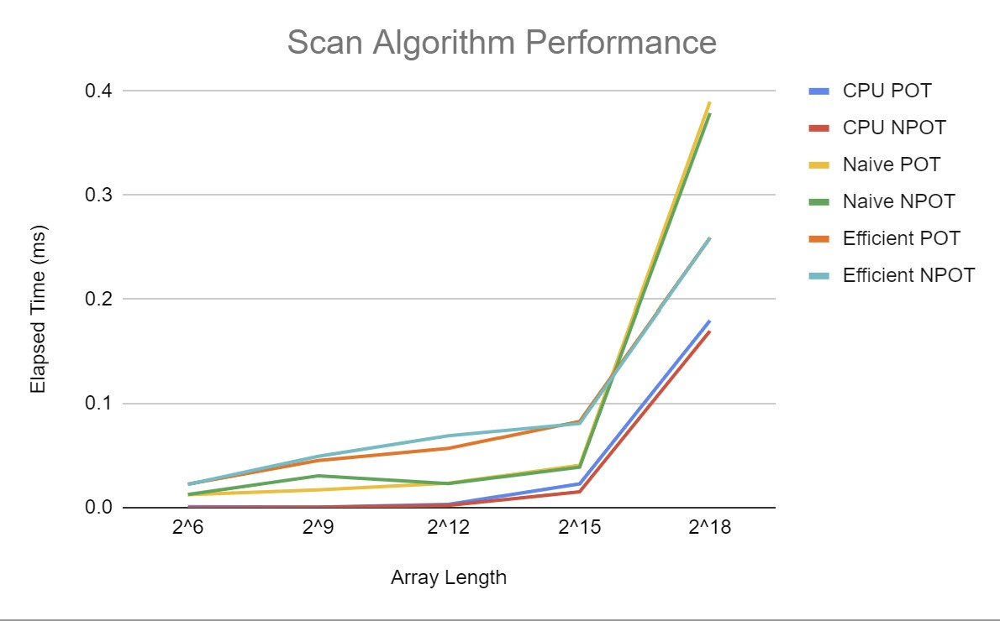

**University of Pennsylvania, CIS 565: GPU Programming and Architecture,
Project 2 - CUDA Stream Compaction**

* Nithin Pranesh
  * Here are some links to connect with me: [LinkedIn](https://www.linkedin.com/in/nithin-pranesh), [YouTube](https://www.youtube.com/channel/UCAQwYrQblfN8qeDW28KkH7g/featured), [Twitter](https://twitter.com/NithinPranesh1).
* Tested on: XPS 15 7590, Windows 20H2, i7-9750H @ 2.60GHz 22GB, GTX 1650.

### Project 2: CUDA Stream Compaction

### Overview

This is a series of implementations of the scan (prefix-sum) and compaction algorithms.
- Scan is an array operation that results in an identically sized array with each index containing a partial sum of the input array up to (and sometimes including) that index.
- Compaction is an array operation that results in the same list with all identity elements. This can help compress large sparse arrays to only contain actual information.

This project includes:
- A baseline CPU implementation of scan and compact.
- A naive CUDA GPU-based approach for implementing scan.
- A work-efficient CUDA GPU-based approach for scan and an implementation of compact using this implementation of scan.
- A wrapper for the scan implementation from the "thrust" library.

### Analysis

Lacking a more thorough pass of optimization, the results seem contradictory. For instance, the CPU implementation seems to be the fastest up until a very large array size. Similarly, the work-efficient implementation seems paradoxically slower than the naive approach until very large array sizes.

The CPU and naive GPU approaches are likely close to, if not exactly, optimal due to their simplicity. The work-efficient implementation on the other hand has some obvious optimization that can be done. While the work-efficient algorithm conserves work, threads are currently being launched carelessly even when they clearly will not be required to do any work on that iteration. Fixing this should result in an immediate improvement of performance.

Lastly, varying block-size for each implementation while holding the array size fixed does not yield any significant improvement / deterioration. The typical block size of 128 seems to work fine.

