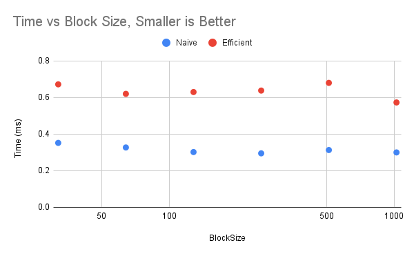
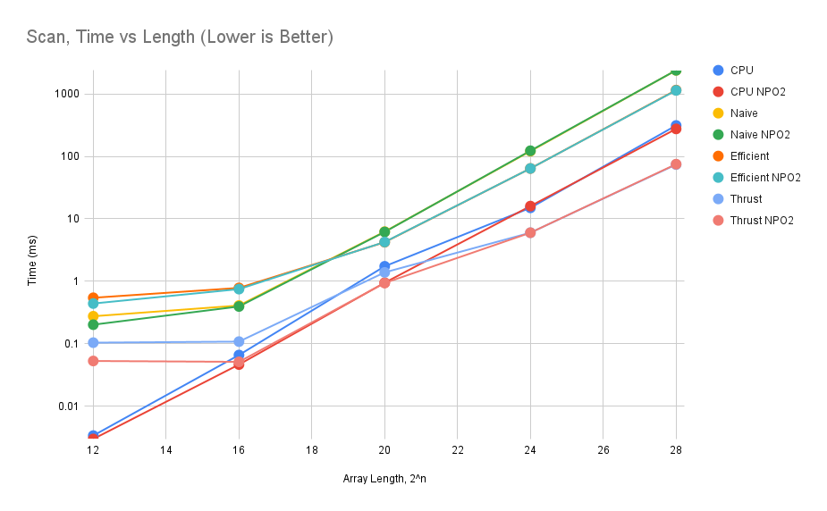
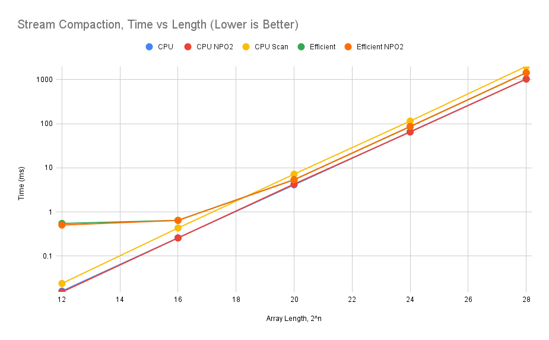
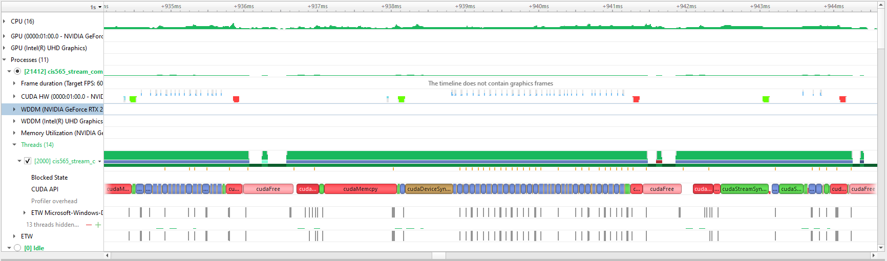

CUDA Stream Compaction
======================

**University of Pennsylvania, CIS 565: GPU Programming and Architecture, Project 2**

* Richard Chen
  * [LinkedIn](https://www.linkedin.com/in/richardrlchen/)
* Tested on: Windows 11, i7-10875H @ 2.3GHz 16GB, RTX 2060 MAXQ 6GB (PC)

## Overview
The purpose of this project was to explore parallel algorithms, something a GPU 
excels at. To that end, we used the GPU to perform stream compaction via scan.
Stream compaction filters out elements from a list, in this case discarding the 0
elements from the input. Scan is a fold but all the intermediate steps are also 
available. 

## Features
* CPU implementation of scan 
* CPU implementation of stream compaction
* Naive parallel version of scan for GPU implemented in CUDA
* Work efficient parallel version of scan for GPU implemented in CUDA
* Stream Compaction that leverages the GPU scan

## Example Output
Tested on 256 element array
```
****************
** SCAN TESTS **
****************
    [  28   7  23   2  29  27  22  19   2  38  26  47  45 ...  43   0 ]
==== cpu scan, power-of-two ====
   elapsed time: 0.0005ms    (std::chrono Measured)
    [   0  28  35  58  60  89 116 138 157 159 197 223 270 ... 6050 6093 ]
==== cpu scan, non-power-of-two ====
   elapsed time: 0.0003ms    (std::chrono Measured)
    [   0  28  35  58  60  89 116 138 157 159 197 223 270 ... 6016 6031 ]
    passed
==== naive scan, power-of-two ====
   elapsed time: 0.243616ms    (CUDA Measured)
    a[1] = 28, b[1] = 0
    FAIL VALUE
==== naive scan, non-power-of-two ====
   elapsed time: 0.17504ms    (CUDA Measured)
    a[1] = 28, b[1] = 0
    FAIL VALUE
==== work-efficient scan, power-of-two ====
   elapsed time: 0.325728ms    (CUDA Measured)
    passed
==== work-efficient scan, non-power-of-two ====
   elapsed time: 0.335584ms    (CUDA Measured)
    passed
==== thrust scan, power-of-two ====
   elapsed time: 0.1088ms    (CUDA Measured)
    passed
==== thrust scan, non-power-of-two ====
   elapsed time: 0.048928ms    (CUDA Measured)
    passed

*****************************
** STREAM COMPACTION TESTS **
*****************************
    [   0   3   1   3   1   1   0   2   2   0   0   1   2 ...   3   0 ]
==== cpu compact without scan, power-of-two ====
   elapsed time: 0.0013ms    (std::chrono Measured)
    [   3   1   3   1   1   2   2   1   2   2   2   1   2 ...   3   3 ]
    passed
==== cpu compact without scan, non-power-of-two ====
   elapsed time: 0.0012ms    (std::chrono Measured)
    [   3   1   3   1   1   2   2   1   2   2   2   1   2 ...   2   2 ]
    passed
==== cpu compact with scan ====
   elapsed time: 0.0015ms    (std::chrono Measured)
    [   3   1   3   1   1   2   2   1   2   2   2   1   2 ...   3   3 ]
    passed
==== work-efficient compact, power-of-two ====
   elapsed time: 0.36784ms    (CUDA Measured)
    passed
==== work-efficient compact, non-power-of-two ====
   elapsed time: 0.3792ms    (CUDA Measured)
    passed
Press any key to continue . . .
```

## Performance Analysis
Optimizing Block Size
<br>
  
  
There does not seem to be a significant difference when tested on size 2^16. 

Performance as a function of array length
<br>
  
  
Notice that the time axis is log scaled. The crossover between the naive and 
efficient implementations happens around length 2^19. 

Stream Compaction as a function of array length
<br>
  
  
Notice that the time axis is log scaled. Even with arrays of up to length 
2^28, the single threaded CPU is still faster for stream compactification. 
This goes to show how parallelism and concurrency should be used situationally
as in many scenarios, the drawbacks might outweigh the benefits. 

### Nsight
Profiling the execution on arrays of length 2^16
<br>  
 
In the CUDA HW row, green represents host->device and 
red represents device->host. Thus we can see that these pairs neatly bracket
the naive implementation, the work-efficient implementation, and using 
the thrust library. 
  
Up to 936ms is the naive GPU version. It looks about half as long as the 
work efficient implementation. The work efficient implementation iterates through
the layers of the "tree" twice, once on the upsweep and once on the downsweep. 
Until the arrays are large enough, the larger number of computations performed
will not overcome the overhead incurred from taking twice the number of steps. 
When tested on length 2^20 arrays, the work efficient implementation was faster.

The thrust implementation is significantly faster and also has far fewer kernel 
calls. This seems reasonable as there probably is overhead that is incurred when
spawning multiple kernels so being able to fit the operation into fewer kernel
calls would drastically cut down on this. Additionally, thrust probably has 
shared memory optimizations, memory access optimizations, and more efficient
computation. 

For all 3, the kernel executions themselves have lots of empty time in between
computations which suggests there is some form of IO bottleneck. 


