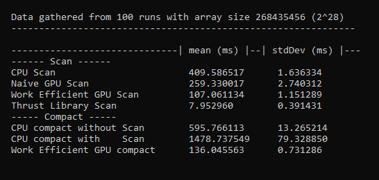

CUDA Stream Compaction
======================

**University of Pennsylvania, CIS 565: GPU Programming and Architecture, Project 2**

* Matt Elser
  * [LinkedIn](https://www.linkedin.com/in/matt-elser-97b8151ba/), [twitter](twitter.com/__mattelser__ )
* Tested on: Tested on: Ubuntu 20.04, i3-10100F @ 3.6GHz 16GB, GeForce 1660 Super 6GB

### Main Features
This project implements an exclusive scan (performing an operation on (in this case a sum of) all previous 
elements along an array) and stream compaction (removing elements from an array based on a condition) using 
the CPU, GPU with CUDA, and the CUDA powered library `Thrust`. 

### Time Comparison
The test setup in `main.cpp` has been coopted to set up repeated timings to remove noise from measurements.

### Block Size Comparison
changing the number of threads per block

### Known limitations
- [FIXED] The Naive implementation fails for array sizes greater than 2^25. 
  - Naive was calling an inefficient number of threads, leading to higher-than needed `threadIdx.x` 
    values. When multiplied to get the `index` this overflowed int and yielded a negative index.
    Logic around indices (reasonably) assumed positive values and therefore caused an out of bounds write.
- compact scan fails for array sizes greater than 2^28 due to running out of CPU memory on the (16Gb) test machine.
