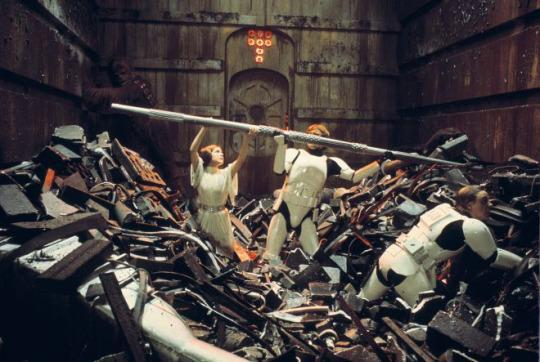
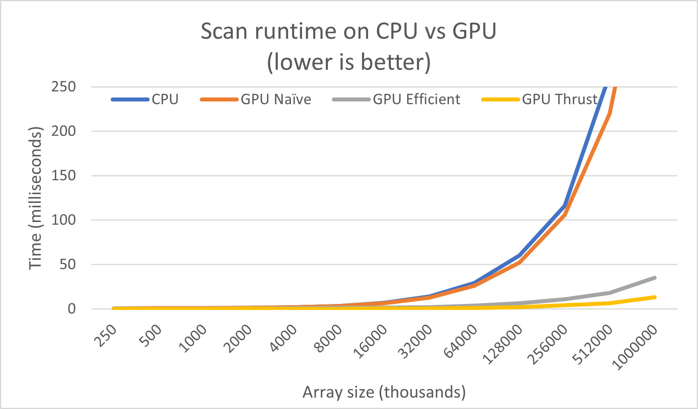
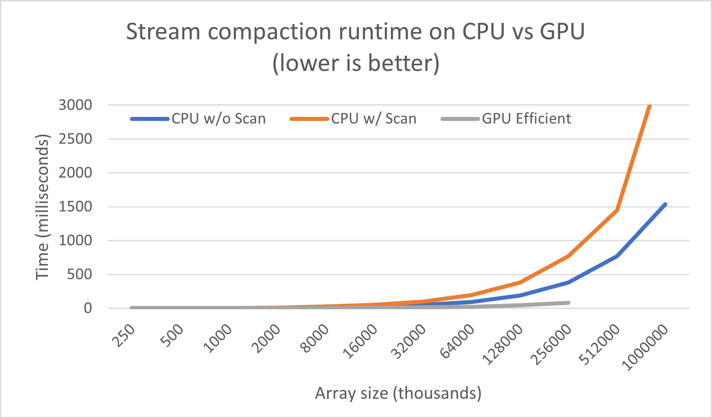

**University of Pennsylvania, CIS 565: GPU Programming and Architecture**
# Project 2 - CUDA Stream Compaction

* Jonas Oppenheim ([LinkedIn](https://www.linkedin.com/in/jonasoppenheim/), [GitHub](https://github.com/oppenheimj/), [personal](http://www.jonasoppenheim.com/))
* Tested on: Windows 10, Ryzen 9 5950x, 32GB, RTX 3080 (personal machine)

<a href="https://www.youtube.com/watch?v=7U3Oti2L8S4"></a>


## Introduction
This is the second project of my GPU Programming course at UPenn. The goal of this project was to implement two different algorithms both on the CPU and GPU and compare performance. Specifically, we were tasked with implementing the scan and stream compaction algorithms. Brief descriptions of both follow.

The [scan](https://en.wikipedia.org/wiki/Prefix_sum) algorithm involves summing array elements up to each index. For example, given array X=[x1, x2, ..., xn], the output would be [x1, x1+x2, x1+x2+x3, ..., x1+..+xn]. The two variations of this algorithm are _inclusive_ and _exclusive_ scan and the distinction between these variations is uninteresting. The stream compaction algorithm is essentially a high performance filter operation that is commonly used to remove zeros from an array. Stream compaction uses the scan algorithm as one of its steps. What these two algorithms have in common is that they are simple to understand, trivial to implement on the CPU, but _embarassingly parallel_, meaning that they're begging to be implemented on the GPU. The details underling both algorithms and their parallel implementations are provided in [Chapter 39 of GPU Gems 3](https://developer.nvidia.com/gpugems/gpugems3/part-vi-gpu-computing/chapter-39-parallel-prefix-sum-scan-cuda).

I implemented parts 1 - 4, and bonus part 7 using shared memory in the GPU Efficient Scan kernel.

The next section covers a performance overview of the various implementations and the final section contains my concluding thoughts about the assignment.

## Performance analysis
The following two plots demonstrate how the Scan and Stream Compaction algorithms perform on arrays of varying sizes on both the CPU and GPU. The block size used on the GPU was 128. Array sizes were tested both with exact powers-of-two and non-powers-of-two. There was no noticable difference in performance between the two, since the algorithm begins by simply padding the non-power-of-two array. The plots below show only the power-of-two results.




The left figure shows Scan runtimes. It is seen that the naive GPU implementation is essentially as inefficient as the non-parallel CPU implementation. As expected, Thrust on the GPU outperforms my "efficient" GPU implementation, but at least there is a noticable difference between my naive and efficient GPU implementations.

The right figure shows the Stream Compaction runtimes where it is seen that both CPU implementations slow down rapidly while the GPU implementation actually suffers from an Out Of Memory error before breaking a sweat. This is a clear example of the space-time tradeoff in algorithmic efficiency.

A few additional notes follow.
- There was an extremely pernicious bug where I used a `float` instead of an `int` and ended up with semi-determinsitic off-by-one-or-two errors with large array sizes. This same value is a `float` in GPU Gems 3, [Chapter 39](https://developer.nvidia.com/gpugems/gpugems3/part-vi-gpu-computing/chapter-39-parallel-prefix-sum-scan-cuda), which is the inspiration for this project.
- The GPU Scan function signature originally looked like
    ```
    void scan(int n, int *odata, const int *idata)
    ```
    This is a function that returns nothing and takes as input two pointers to CPU-side arrays. The algorithm begins by copying `idata` to the GPU and ends by copying the result from the GPU into `odata`. An issue I ran into was that for arrays of a sufficiently large size, this function would need to make a recursive call. The reason for this is covered towards the end of the aforementioned GPU Gems 3 chapter.

    I modified this function signature to look like
    ```
    int* scan(int n, int *odata, int *idata)
    ```
    If the number of blocks needed is greater than 1, then a recursive call is made, where `odata` is `NULL` and `idata` is a GPU-side pointer.

    The base case is when the requisite number of blocks is 1. In this case, if `odata` is supplied then it is assumed that there was no recursive call and `idata` is a CPU-side pointer. If `odata` was not supplied, then this is assumed to have been a recursive call, `idata` is assumed to be a GPU-side pointer, and the function returns another pointer to GPU memory.

    What follows is an example of the logs generated during recursive calls.
    ```
    ==== work-efficient scan, power-of-two ====

    paddedN: 16777216
    grid size: 65536
    block size: 128

    paddedN: 65536
    grid size: 256
    block size: 128

    paddedN: 256
    grid size: 1
    block size: 128
    ```
    This function was difficult but fun to implement and I am pleased with how well it kept up with Thrust's Scan implementation. Part of the reason may be due to the fact that I had my kernel copy global memory to shared memory, which is much faster.

## Concluding thoughts
- The work-efficient parallel scan algorithm was the most complicated code I've ever written. While coding, I felt as though I was building a card castle in my mind and any distraction would knock it over and I'd have to start over. It just required a large mental cache in order to make progress.
- I think that well-written CPU code is self-documenting; if you use descriptive variable and function names, and give each function a single purpose, then there is little need for code comments. I'm starting to believe that no matter how nicely written CUDA code is, it will always require comments for a future reader. With CPU code, I may sacrifice some performance for readability. With GPU code, I'm realizing that all readability is sacrificed for performance. Machine-efficient code is simply not readable.
- I think this may be a good assignment to start with because it allows us to discover clearly how to take a simple CPU algorithm and implement it on the GPU for maximum performance. Also, we were shown how there are many ways the algorithms can be optimized, but I was a little frustrated that that lecture was *the day before* this was due. I think we could get a lot out of spending time optimizing this algorithm.

## Program output
```
****************
** SCAN TESTS **
****************
    [   8  18  44   9  36  16  44  17   6  39  36  19  10 ...  42   0 ]
==== cpu scan, power-of-two ====
   elapsed time: 0.0061ms    (std::chrono Measured)

==== cpu scan, non-power-of-two ====
   elapsed time: 0.007ms    (std::chrono Measured)
    passed

==== naive scan, power-of-two ====
   elapsed time: 0.591936ms    (CUDA Measured)
    passed

==== naive scan, non-power-of-two ====
   elapsed time: 0.576512ms    (CUDA Measured)
    passed

==== work-efficient scan, power-of-two ====

paddedN: 16384
grid size: 32
block size: 256

paddedN: 32
grid size: 1
block size: 16
   elapsed time: 0ms    (CUDA Measured)
    passed

==== work-efficient scan, non-power-of-two ====

paddedN: 16384
grid size: 32
block size: 256

paddedN: 32
grid size: 1
block size: 16
   elapsed time: 0ms    (CUDA Measured)
    passed

==== thrust scan, power-of-two ====
   elapsed time: 0.195584ms    (CUDA Measured)
    passed

==== thrust scan, non-power-of-two ====
   elapsed time: 0.041984ms    (CUDA Measured)
    passed


*****************************
** STREAM COMPACTION TESTS **
*****************************
    [   0   0   1   0   2   2   3   1   3   3   0   3   2 ...   2   0 ]
==== cpu compact without scan, power-of-two ====
   elapsed time: 0.0285ms    (std::chrono Measured)
    passed

==== cpu compact without scan, non-power-of-two ====
   elapsed time: 0.0255ms    (std::chrono Measured)
    passed

==== cpu compact with scan ====
   elapsed time: 0.0806ms    (std::chrono Measured)
    passed

==== work-efficient compact, power-of-two ====

paddedN: 16384
grid size: 32
block size: 256

paddedN: 32
grid size: 1
block size: 16
   elapsed time: 0.045056ms    (CUDA Measured)
    [   1   2   2   3   1   3   3   3   2   3   1   1   2 ...   1   2 ]
    passed

==== work-efficient compact, non-power-of-two ====

paddedN: 16384
grid size: 32
block size: 256

paddedN: 32
grid size: 1
block size: 16
   elapsed time: 0.041984ms    (CUDA Measured)
    [   1   2   2   3   1   3   3   3   2   3   1   1   2 ...   1   3 ]
    passed

Press any key to continue . . .
```
