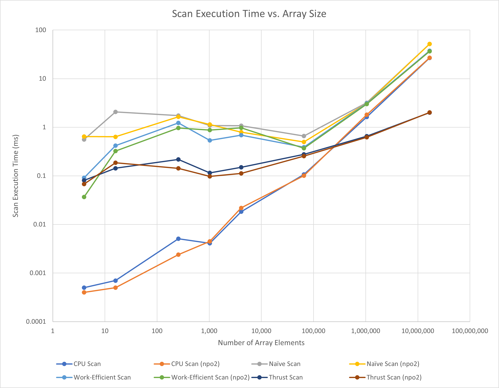
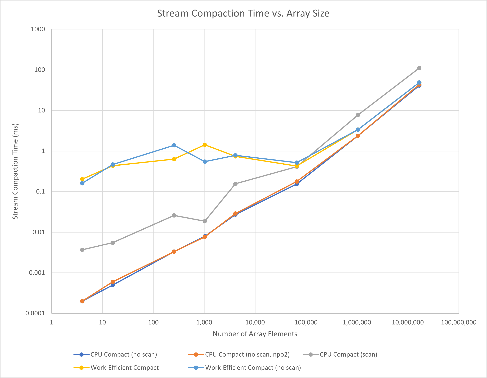
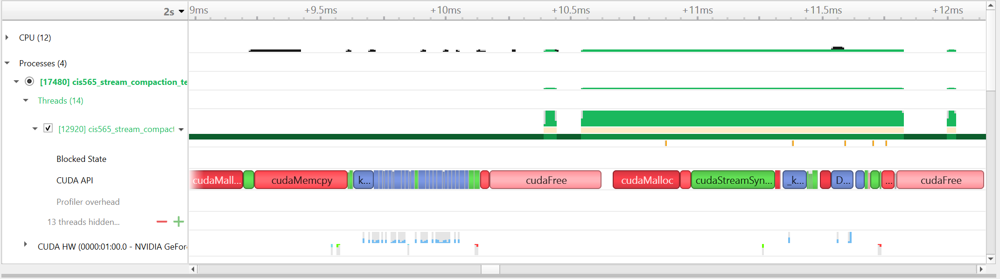

CUDA Stream Compaction
======================

**University of Pennsylvania, CIS 565: GPU Programming and Architecture, Project 2**

* Aditya Hota
  * [LinkedIn](https://www.linkedin.com/in/aditya-hota)
* Tested on: Windows 11, i7-8750H @ 2.20 GHz 20 GB, GTX 1050 Ti with Max-Q Design 6 GB (personal laptop)

# Overview
This project involved implementing two algorithms (scan and stream compression) in parallel on the GPU. This allows us to work on a large set of data using multiple GPU threads at once, rather than relying on the sequential nature of the GPU.

## Features
* A naive parallel scan algorithm implemented in CUDA
* A work efficient parallel scan algorithm implemented in CUDA
* A stream compaction algorithm which leverages the scan algorithm to remove null data elements from an array of data
* CPU implementations of the scan and stream compaction arrays to provide a baseline comparison

# Sample Output
The program generates two arrays--one a power of two, and one slightly smaller. Then, the scan algorithm is run on both arrays. Lastly, the arrays of data are compacted by removing any zeroes. The scan algorithm is used to more easily find the indices of the non-zero values to write to the final output array.

Below is the sample output for a size 1024 array.

```
****************
** SCAN TESTS **
****************
    [  35  34  18  10  18   0   9  37  11  41  35  17   1 ...   2   0 ]
==== cpu scan, power-of-two ====
   elapsed time: 0.011ms    (std::chrono Measured)
    [   0  35  69  87  97 115 115 124 161 172 213 248 265 ... 100120 100122 ]
==== cpu scan, non-power-of-two ====
   elapsed time: 0.0109ms    (std::chrono Measured)
    [   0  35  69  87  97 115 115 124 161 172 213 248 265 ... 100031 100079 ]
    passed
==== naive scan, power-of-two ====
   elapsed time: 0.562432ms    (CUDA Measured)
    passed
==== naive scan, non-power-of-two ====
   elapsed time: 0.48176ms    (CUDA Measured)
    passed
==== work-efficient scan, power-of-two ====
   elapsed time: 0.32256ms    (CUDA Measured)
    passed
==== work-efficient scan, non-power-of-two ====
   elapsed time: 0.32768ms    (CUDA Measured)
    passed
==== thrust scan, power-of-two ====
   elapsed time: 0.663552ms    (CUDA Measured)
    passed
==== thrust scan, non-power-of-two ====
   elapsed time: 0.059392ms    (CUDA Measured)
    passed

*****************************
** STREAM COMPACTION TESTS **
*****************************
    [   2   3   3   2   2   2   0   1   3   3   1   1   0 ...   1   0 ]
==== cpu compact without scan, power-of-two ====
   elapsed time: 0.0173ms    (std::chrono Measured)
    [   2   3   3   2   2   2   1   3   3   1   1   2   2 ...   2   1 ]
    passed
==== cpu compact without scan, non-power-of-two ====
   elapsed time: 0.021ms    (std::chrono Measured)
    [   2   3   3   2   2   2   1   3   3   1   1   2   2 ...   2   2 ]
    passed
==== cpu compact with scan ====
   elapsed time: 0.0583ms    (std::chrono Measured)
    [   2   3   3   2   2   2   1   3   3   1   1   2   2 ...   2   1 ]
    passed
==== work-efficient compact, power-of-two ====
   elapsed time: 0.646144ms    (CUDA Measured)
    passed
==== work-efficient compact, non-power-of-two ====
   elapsed time: 0.377856ms    (CUDA Measured)
    passed
```

# Performance Analysis
Several versions of the scan algorithm were implemented: CPU, naive, work-efficient, and Thrust. The CPU implementation sequentially performs scan and scatter to remove any 0 elements. The naive GPU implementation performs sequential sums as pairs and eventually collapses all values into a single sum. The work-efficient algorithm uses an up-sweep (reduction) and down-sweep algorithm which exploits a greater degree of parallelism and should theoretically result in improved performance.

The best performance was achieved using a block size of 128 on my GPU; this gave me the smallest runtime for both the naive and work-efficient implementations of the scan algorithms. I tried powers of 2 ranging from 64 to 1024.

From the graphs shown below, we can see that we did not attain the improvement from the wofk-efficient algorithm that we had hoped. In fact, the work-efficient scan algorithm performs marginally better than the naive algorithm and worse than the CPU implementation. The Thrust algorithm performs the best, but this is expected because there are many optimizations that take place, such as exploiting unused threads and shared memory. Please note that the graphs are log-log plots, and that `npo2` in the legend refers to the non-power of 2 test case.

<br>


<br>


The performance hit for the naive and work-efficient and algorithms is largely due to the global memory accesses in the up sweep and down sweep steps. We access data from the global data arrays which are passed into the kernel, and this is very inefficent as global memory is the slowest type of memory access. An optimization to this would be to use shared memory (similar to the matrix multiply example) and data prefetching. Since we are doing just addition operations, the performance hit is not due to compute instructions.

We can see the impacts of parallelism beginning to manifest. For small array scans, the CPU is a much better option compared to the GPU; however, as the array size increases, the large number of threads on the GPU allows more computation to be performed at once. On the graph, this is shown by the CPU runtimes (in blue and orange) increasing as a much faster rate than the GPU runtimes. The Thrust implementation highlights this the most, because its rate of change of runtime as a function of array size is much smaller than that of the CPU. In theory, my GPU would allow me to ultimate reach better performance than the CPU, but I was not able to reach this point as the maximum array size supported was `10^27`. I believe part of the reason for the worse GPU performance is that I have the lowest tier Pascal GPU. One test I would like to run in the future is the scan algorithm on a GTX 1070 eGPU that I can access.

## NSight Analysis
To get a better idea of why the Thrust library runs more quickly than the work-efficient algorithm, we can trace the execution in NSight to see which components take the longest to run. Below is the output comparing the work-efficient GPU scan (non power of two) to the Thrust scan (non power of two). The work-efficient scan runs from 9 ms till about 10.62 ms, and the Thrust scan runs from 10.67 ms till 12.15 ms.

<br>



The bottom row shows the CUDA usage--green is copying data from host to device and red is copying data from device to host; blue is when the kernel runs. As we can see, the green and red data usage is about the same since data needs to go to the GPU and back. However, our work-efficient implementation executes the kernel for a longer time. This leads me to believe that the execution takes longer in our algorithm, but I am not sure if this includes global memory reads as well. Either way, the GPU is utilized for a longer period of time. The Thrust library is making optimizations to reduce memory read times and compute, which lets it achieve a much better performance.