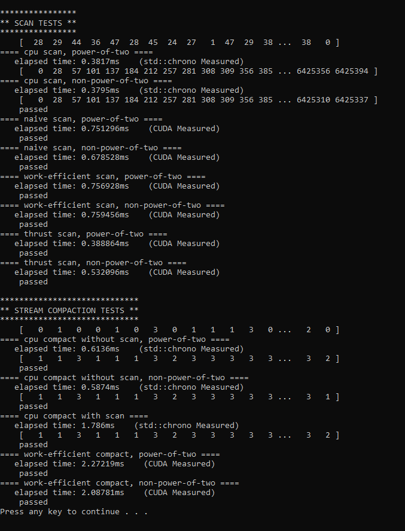

CUDA Stream Compaction
======================

**University of Pennsylvania, CIS 565: GPU Programming and Architecture, Project 2**

* Shubham Sharma
  * [LinkedIn](www.linkedin.com/in/codeshubham), [personal website](https://shubhvr.com/).
* Tested on: Windows 10, i7-9750H @ 2.26GHz, 16GB, GTX 1660ti 6GB (Personal Computer).
*GPU Compute Capability: 7.5

## Stream Compaction
This project involves 
-   CPU version of Scan,
-   CPU version of Compact without using the Scan algorithm,
-   CPU version of Compact with Scan,
-   Naive version of Scan,
-   Work-efficient version of Scan, and
-   Work-efficient version of Compact that used the work-efficient Scan's code.

The three cpu calculations are serialized; no multi-threading was consolidated. We have used simple cpu scan and compaction to compare the results with the GPU parallelised algorithm implementation. All the results are then compared. Results of CUDA's Thrust library are also used to compare the execution times of each implementation.   

## Performance Analysis
The projects implements both CPU and GPU timing functions as a performance timer class to conveniently measure the time cost. `std::chrono` is used, to provide CPU high-precision timing and CUDA event to measure the CUDA performance. 
I have collected the data across 8 executions with different array sizes to collect the data. The program generates a new array of random values with each execution, where the size of array is customisable. I have varied the size of the arrays by powers of two, starting from 2^6^ all the wai to 2^28^. The program also executes each algorithm for arrays of size "non- power of two" which are generated truncating the "power of two" arrays. 

## Scan Runtime Analysis
The performance of the four scan functions is graphed below. 

- CPU Scan vs Other : From the graph above we can see that for array of smaller sizes the CPU implementation is way better than GPU Scan implementations but as the size of array increases the performance gap starts decreasing. This can be attributed toward the serialized algorithm/ implementation for CPU compared to the parallel implementation on the GPU. At some size of an array the GPU implementation would definitely have crossed over CPU's but, Unfortunately my GPU ran out of memory before i could reach that point. 
- Naive vs Work Efficient : Throughout the executions of different sizes of Arrays the Naive Implementation performed consistently better than the Work Efficient. This is due to the fact that
	- Even though it looks like we have limited the number of active threads while performing "Upsweeep" and "Downsweep" the threads which are not doing anything have to wait for the other active threads in the warp to finish to become available again.
	- Those idle threads cant be utilised by the GPU to perform any other tasks in the same depth of an upsweep or downsweep thereby decreasing our Parallelism.

## Radix Sort (Extra Credit)
I have implemented "Parallel" radix sort which effectively work on compare bits of a decimal number by converting them to binary. This process starts by comparing least significant bit and continues until we have reached the most significant bit. 
To check the authenticity of my implementation, I have compared results from mine to CUDA's Thrust::sort results. I tested it from 2^6^ size arrays upto 2^26^ where it passed on all the scenario's thereby validating my implementation. A screenshot of my result is shown below. An array of size 2^18^ is used.

## Blooper
Apparently on the GPU side function: pow(2,12)  was returning a value of 4027 which is super absurd. I fixed it by using bitwise opertaion 1<<12 which gave me the expected result 4028.