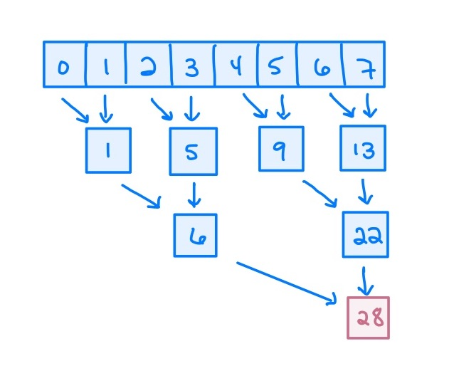
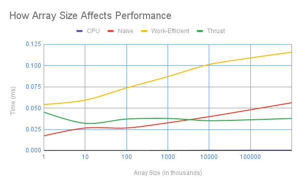
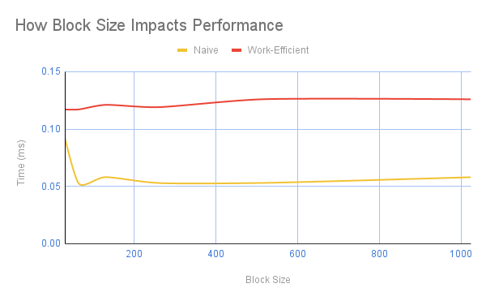

CUDA Stream Compaction
======================

**University of Pennsylvania, CIS 565: GPU Programming and Architecture, Project 2**

* Ashley Alexander-Lee
  * [LinkedIn](linkedin.com/in/asalexanderlee), [Personal Website](https://asalexanderlee.myportfolio.com/)
* Tested on: Windows 10, i7-6700 @ 3.40GHz 16GB, Quadro P1000 (Moore 100A Lab)

### Project Description
This project involved practice writing parallel algorithms in Cuda, chiefly scan, reduction, and compaction. For comparison, I wrote algorithms on the CPU, as well as naive and work-efficient methods that leverage the GPU.

#### Parallel Reduction
Parallel reduction is an algorithm by which you can add all of the numbers in an array, in parallel. You can achieve this by adding pairs of numbers, looping through the algorithm log(n) times, where n is the size of the array.

#### Scan (Prefix Sums)
A scan of an array produces an array where each element represents a sum of the elements that came before it. This algorithm involves adding numbers based on a logarithmic offset, as illustrated below. The last element in the array will represent the reduction. Below is an illustration of a naive parallel scan algorithm, which runs in O(log(n)) time. 

We can improve upon this algorithm by doing scan in two steps: 1) parallel reduction, and 2) calculation of partial sums to finish the scan. The parallel reduction occurs as described above. The calculation of partial sums works as illustrated below: 

#### Compaction
Compaction involves taking an array of values and returning an array filled with only the values that are "truthy". You can do this by performing the following steps:

1. Convert all "truthy" values to 1s and all others to 0s
2. Perform scan on the resulting array. The result of scan should give you the desired indices in the output compact array for all true values 
3. Use the indices to write the true values to a compact array

### Performance Analysis

### Future Work

