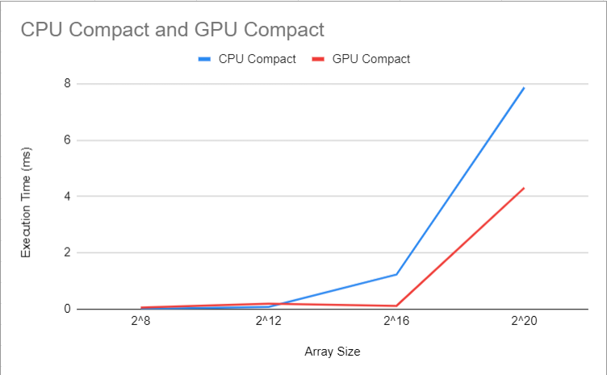

CUDA Stream Compaction
======================

**University of Pennsylvania, CIS 565: GPU Programming and Architecture, Project 2**

* Lindsay Smith
  *  [LinkedIn](https://www.linkedin.com/in/lindsay-j-smith/), [personal website](https://lindsays-portfolio-d6aa5d.webflow.io/).
* Tested on: Windows 10, i7-11800H 144Hz 16GB RAM, GeForce RTX 3060 512GB SSD (Personal Laptop)

For this project I implemented scan and compact algorithms and compared their various runtimes
on the GPU and CPU, testing with various array sizes and analyzing how efficient each one was.

Implemenation includes:
* CPU Scan + Stream Compaction
* GPU Naive Scan
* GPU Work-Efficient Scan
* GPU Work-Efficient Compaction
* Thrust Scan (mainly for comparison purposes)

For all of my analysis I am utilizing a block size of 256, which I found to be optimal.


In this graph the lower times are better. 
We can see that the CPU is actually faster than the GPU for most array sizes.
I did have exceptions to this however in the range of about 2^16 - 2^18, where the GPU scans were faster. Of course we 
can also see that the Thrust scan is faster than all of the implementations I wrote, again with an exception at 2^16.
I am not sure the reason for this, but it seems that an array size around 2^16 is somewhat optimal for performance of
my implementations. If I continue with arry sizes into the millions, past what is shown in the graph, the discrepency
in the execution times only widens.

It is very clear that Thrust has optimizations far beyond my own implementations. With a small data set the differences
are not as apparent, but again once we reach thousands and millions of data points in the array, it is clear how 
much more efficient the Thrust algorithm is. I would assume that Thrust takes advantage of memory, as I know that
my implementation could be made more efficient by writing to contiguous memory and allowing the threads that are not working
to be reused. If my implementations took advantage of this I would be able to reduce the number of threads by half at
each kernel call, and therefore would have more threads available to do work for other calls.



In this graph we also want to note that the lower values are faster runtimes and therefore "better". 
It is interesting here that although for scan the CPU was consistently faster than the GPU, once we add the compact step
the CPU is no longer faster. The GPU here is only slower than the CPU for very small array sizes, but once we get into arrays
with thousands and especially millions of elements the GPU is definitively faster. This is probably due to the fact that
the GPU is taking advantages of a very high number of threads, whereas the CPU cannot do that and takes a very long time to 
calculate each step of the compact algorithm. 

```
****************
** SCAN TESTS **
****************
    [  46  29  32  19  41  43  12  31   4  10   2   6  39 ...   0   0 ]
==== cpu scan, power-of-two ====
   elapsed time: 0.3919ms    (std::chrono Measured)
    [   0  46  75 107 126 167 210 222 253 257 267 269 275 ... 6427122 6427122 ]
==== cpu scan, non-power-of-two ====
   elapsed time: 0.3764ms    (std::chrono Measured)
    [   0  46  75 107 126 167 210 222 253 257 267 269 275 ... 6427059 6427087 ]
    passed
==== naive scan, power-of-two ====
   elapsed time: 0.100352ms    (CUDA Measured)
    passed
==== naive scan, non-power-of-two ====
   elapsed time: 0.098304ms    (CUDA Measured)
    passed
==== work-efficient scan, power-of-two ====
   elapsed time: 0.206848ms    (CUDA Measured)
    passed
==== work-efficient scan, non-power-of-two ====
   elapsed time: 0.205824ms    (CUDA Measured)
    passed
==== thrust scan, power-of-two ====
   elapsed time: 0.171008ms    (CUDA Measured)
    passed
==== thrust scan, non-power-of-two ====
   elapsed time: 0.17728ms    (CUDA Measured)
    passed

*****************************
** STREAM COMPACTION TESTS **
*****************************
    [   3   3   0   0   0   3   1   3   2   0   0   2   0 ...   2   0 ]
==== cpu compact without scan, power-of-two ====
   elapsed time: 0.6072ms    (std::chrono Measured)
    [   3   3   3   1   3   2   2   3   3   3   3   1   3 ...   1   2 ]
    passed
==== cpu compact without scan, non-power-of-two ====
   elapsed time: 0.572ms    (std::chrono Measured)
    [   3   3   3   1   3   2   2   3   3   3   3   1   3 ...   2   1 ]
    passed
==== cpu compact with scan ====
   elapsed time: 1.4129ms    (std::chrono Measured)
    [   3   3   3   1   3   2   2   3   3   3   3   1   3 ...   1   2 ]
    passed
==== work-efficient compact, power-of-two ====
   elapsed time: 0.219264ms    (CUDA Measured)
    passed
==== work-efficient compact, non-power-of-two ====
   elapsed time: 0.219136ms    (CUDA Measured)
    passed```


