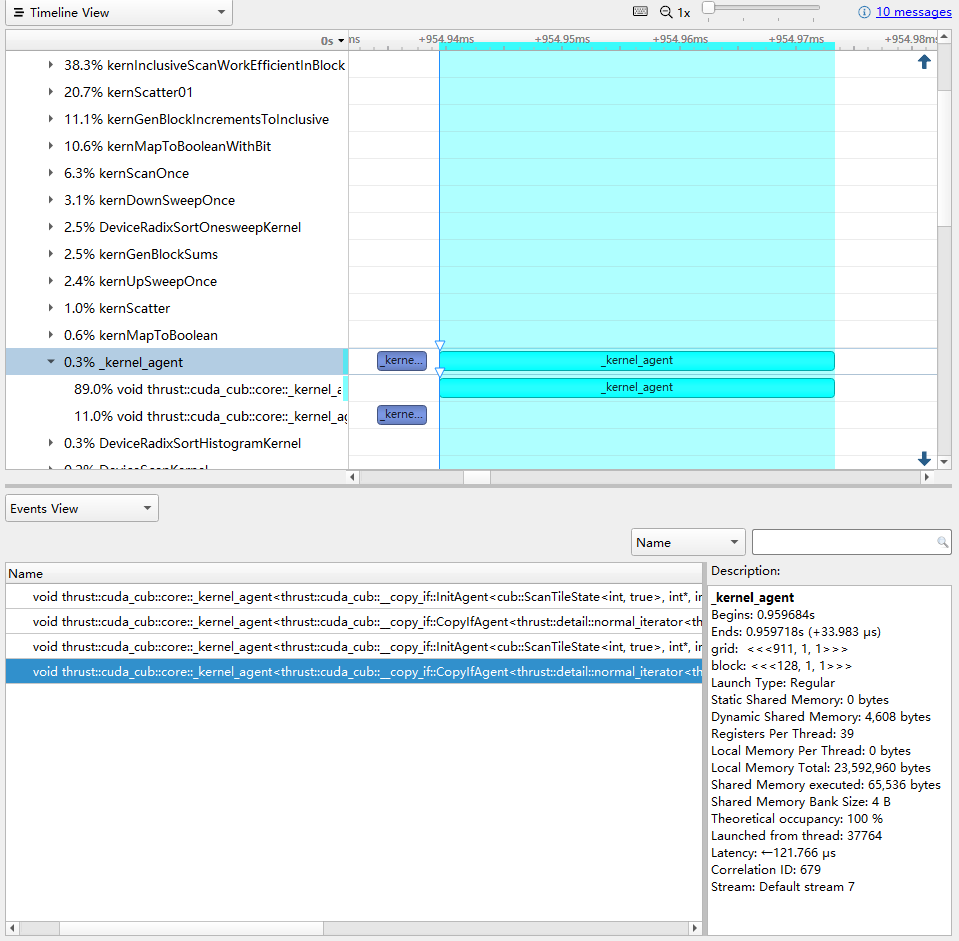

CUDA Stream Compaction
======================

**University of Pennsylvania, CIS 565: GPU Programming and Architecture, Project 2**

* Xuntong Liang
  * [LinkedIn](https://www.linkedin.com/in/xuntong-liang-406429181/), [GitHub](https://github.com/PacosLelouch), [twitter](https://twitter.com/XTL90234545).
* Tested on: Windows 10, i7-10750H @ 2.60GHz 16GB, RTX 2070 Super with Max-Q 8192MB

## Tasks

In this project, I have done several tasks include: 

- Implemented the CPU scan and stream compaction without and with scan. 
- Implemented the "Naïve" GPU scan. 
- Implemented the "Work-Efficient" GPU scan and stream compaction. Optimized these implementations to be faster than CPU's implementations. (Extra Credit)
- Implemented the "Work-Efficient-Hierarchical" GPU scan and stream compaction, which take advantage of shared memory. (Extra Credit) 
- Implemented the radix sort with the "Work-Efficient-Hierarchical". (Extra Credit) 
- Compared those with Thrust's implementation of "exclusive_sort", "remove_if", and "sort", and the CPU quick sort. 
- Completed performance analysis with `Nsight`, `std::chrono`, and `cudaEvent`. Generated some plots for comparison. 


### About Work-Efficient-Hierarchical

The `Work-Efficient-Hierarchical` implementation comes up with a recursive algorithm. We divide the array into blocks and compute the inclusive sum in each block. Then we take the last element of each block to be a new array. We compute the exclusive sum of this new array. Each element is added into its corresponding block of the inclusive sum array, and then we get the inclusive sum of the whole array. But how to compute the exclusive sum of the new array if this new array can be divided into multiple blocks? We convert this goal into computing the inclusive sum and shifting it into the exclusive sum. The process of computing the inclusive sum can be the same as what we did just know. Example is shown as the figure below.


### About Radix Sort

I implemented my radix sort by naively sweeping the 31 bits of integer (suppose all of the elements are non-negative), and do stream compaction in each sweep. The outermost function's prototype is `void sort(int n, int* odata, const int* idata)` so it can be called in the same way as `void scan(int n, int *odata, const int *idata)` and `int compact(int n, int *odata, const int *idata)`. 


## Test Output

First of all, let's take a look at a straight-forward test output with 1048576 (2^20) elements. It contains a group of test which tells us the duration of each algorithm and whether it passed the test or not. 

```C++
***************************
** SCAN TESTS 0001048576 **
***************************
    [   8  25  28  12  36  17  34  22  28  36  12   9  21 ...  27   0 ]
==== cpu scan, power-of-two ====
   elapsed time: 0.8124ms    (std::chrono Measured)
    [   0   8  33  61  73 109 126 160 182 210 246 258 267 ... 25676644 25676671 ]
==== cpu scan, non-power-of-two ====
   elapsed time: 0.5706ms    (std::chrono Measured)
    [   0   8  33  61  73 109 126 160 182 210 246 258 267 ... 25676598 25676600 ]
    passed
==== naive scan, power-of-two ====
   elapsed time: 0.699104ms    (CUDA Measured)
    passed
==== naive scan, non-power-of-two ====
   elapsed time: 0.673728ms    (CUDA Measured)
    passed
==== work-efficient scan, power-of-two ====
   elapsed time: 0.311136ms    (CUDA Measured)
    passed
==== work-efficient scan, non-power-of-two ====
   elapsed time: 0.309504ms    (CUDA Measured)
    passed
==== thrust scan, power-of-two ====
   elapsed time: 0.17056ms    (CUDA Measured)
    passed
==== thrust scan, non-power-of-two ====
   elapsed time: 0.161856ms    (CUDA Measured)
    passed
==== work-efficient-hierarchical scan, power-of-two ====
   elapsed time: 0.2256ms    (CUDA Measured)
    passed
==== work-efficient-hierarchical scan, non-power-of-two ====
   elapsed time: 0.227264ms    (CUDA Measured)
    passed

****************************************
** STREAM COMPACTION TESTS 0001048576 **
****************************************
    [   0   3   0   2   2   1   2   0   0   2   2   1   3 ...   1   3 ]
==== cpu compact without scan, power-of-two ====
   elapsed time: 2.6959ms    (std::chrono Measured)
    [   3   2   2   1   2   2   2   1   3   1   1   2   2 ...   1   3 ]
    passed
==== cpu compact without scan, non-power-of-two ====
   elapsed time: 2.3748ms    (std::chrono Measured)
    [   3   2   2   1   2   2   2   1   3   1   1   2   2 ...   3   2 ]
    passed
==== cpu compact with scan, power-of-two ====
   elapsed time: 1.3746ms    (std::chrono Measured)
    [   3   2   2   1   2   2   2   1   3   1   1   2   2 ...   1   3 ]
    passed
==== cpu compact with scan, non-power-of-two ====
   elapsed time: 1.8382ms    (std::chrono Measured)
    [   3   2   2   1   2   2   2   1   3   1   1   2   2 ...   3   2 ]
    passed
==== work-efficient compact, power-of-two ====
   elapsed time: 0.474464ms    (CUDA Measured)
    passed
==== work-efficient compact, non-power-of-two ====
   elapsed time: 0.46448ms    (CUDA Measured)
    passed
==== thrust compact, power-of-two ====
   elapsed time: 0.267296ms    (CUDA Measured)
    passed
==== thrust compact, non-power-of-two ====
   elapsed time: 0.286272ms    (CUDA Measured)
    passed
==== work-efficient-hierarchical compact, power-of-two ====
   elapsed time: 0.350208ms    (CUDA Measured)
    passed
==== work-efficient-hierarchical compact, non-power-of-two ====
   elapsed time: 0.348096ms    (CUDA Measured)
    passed

***************************
** SORT TESTS 0001048576 **
***************************
    [ 25708 19375 9028 5662 11186 20417 26534 15472 11928 29886 16862 23409 11471 ... 17877   0 ]
==== cpu sort, power-of-two ====
   elapsed time: 58.3795ms    (std::chrono Measured)
    [   0   0   0   0   0   0   0   0   0   0   0   0   0 ... 32767 32767 ]
==== thrust sort, power-of-two ====
   elapsed time: 0.516096ms    (CUDA Measured)
    passed
==== work-efficient sort, power-of-two ====
   elapsed time: 13.355ms    (CUDA Measured)
    passed
==== cpu sort, non-power-of-two ====
   elapsed time: 67.2949ms    (std::chrono Measured)
    [   0   0   0   0   0   0   0   0   0   0   0   0   0 ... 32767 32767 ]
==== thrust sort, non-power-of-two ====
   elapsed time: 0.570944ms    (CUDA Measured)
    passed
==== work-efficient sort, non-power-of-two ====
   elapsed time: 13.0683ms    (CUDA Measured)
    passed
```


## Performance Analysis

From the test output above, we can see that the CPU scan appears similar performance with the "Naïve" GPU scan. The "Work-Efficient" scan is faster, and the "Work-Efficient-Hierarchical" scan is much faster, while it is still a bit slower than Thrust's implementation (Which is faster depends on the number of elements. You will see the result in further analysis). The similar phenomena are shown about stream compaction and sorting. 

To get further analysis, I ran 1000 group of tests and compute the average duration of each algorithm. For each test, I chose 2^n elements for n from 12 to 24 with stride of 2. The tests with non-power-of-two number took 2^n-3 elements. 


### Analysis for Scan

Comparisons of duration of scan with power-of-two elements are shown first.


From the plot we can find that when the number of elements is smaller than 65536, CPU scan performs the best, maybe because the computing power of one CPU core is better than the computing power of one GPU core, and CPU can take advantage of cache when the number is small. And when the number is not greater than 1048576, the "Work-Efficient-Hierarchical" implementation is faster than the Thrust's implementation. When the number is very large, the Thrust's implementation performs the best, but we can see that the "Work-Efficient-Hierarchical" appears performance improvement compared to the "Work-Efficient" in all situations. One of the interesting thing is, the "Naïve" implementation is almost worse than the implementation on CPU. The consequence is similar with non-power-of-two elements.

If we take a look at what happened when we call `thrust::exclusive_scan` by `Nsight`, there are two kernel functions called: `DeviceScanInitKernel` and `DeviceScanKernel`. What make me surprised is that there are only 547 blocks with 128 threads in `DeviceScanKernel`, and the number is even smaller in `DeviceScanInitKernel`. Also, these two functions only span about 30 microseconds, but `cudaEvent` tells us the whole process needs about 200 microseconds. Maybe there are some CUDA operations other than kernel functions and I find that `cudaMemcpyAsync` was called. I don't know what magic is in it.


### Analysis for Stream Compaction

Comparisons of duration of stream compaction with power-of-two elements are shown first.


Because the stream compaction algorithm is an application of scan, something is similar to the scan algorithm that, in very small number, CPU runs best. In middle number, `Work-Efficient-Hierarchical` runs the best. In very large number, `thrust::remove_if` runs the best. Another discover is that `CPU-with-Scan` is faster than `CPU-without-Scan`. It seems to do more operations with scan, but maybe because it take advantage of cache while scanning in place. The consequence is similar with non-power-of-two elements.


Also, I am really surprised at what happened with `thrust::remove_if`. Much fewer threads than elements as well. The `cudaMemcpyAsync` was called too. 




### Analysis for Sort

Comparisons of duration of sorting with power-of-two elements are shown first. I use the quick sort in standard library with CPU's implementation.


The GPU's implementations perform better than CPU's implementations with numbers larger than or equal to 65536, although my `Work-Efficient-Hierarchical` is much slower than `thrust::sort`. The `thrust::sort` is faster than the CPU's quick sort even with a small number, which is different from scan and stream compaction. 

My implementation is sweeping the 31 bits of the integer naively (Suppose all the elements are non-negative so that the highest bit is always 0). The Thrust's implementation may be more complicated. Take a look at the kernel functions. There are `DeviceRadixSortHistogramKernel`, `DeviceRadixSortExclusiveSumKernel`, followed by four `DeviceRadixSortOnesweepKernel`. Also, there are several `cudaMemsetAsync` among them (Async again!). The `DeviceRadixSortExclusiveSumKernel` ran in really short time, which makes me curious about what it really does. As far as I am concerned, the `DeiviceRadixSortHistogramKernel` may be critical to avoid sweeping all bits of the integer. 


- All the raw data for performance analysis can be found in the `profile` folder.


## Questions and Answers

- To guess at what might be happening inside the Thrust implementation.
  - It is shown in [Performance Analysis](#performance-analysis).
- Can you find the performance bottlenecks? Is it memory I/O? Computation? Is it different for each implementation?
  - I can find some. I believe the main bottleneck is memory I/O for the `Work-Efficient` series, because it is faster with the hierarchical implementation. It may need more computation but take advantage of shared memory. Actually I haven't done the implementation without bank conflict. This may affect the latency of accessing shared memory. At least the memory I/O strategy can still be improved to make the `Work-Efficient-Hierarchical` faster. However, for the `Naïve` implementation, I think the computation is also a bottleneck, because even the memory-unfriendly `Work-Efficient` implementation performs much better than `Naïve` implementation. It means this implementation arranges too many threads for computation that the GPU cannot deal with it very well, as the GPU can run limited blocks at the same time. 


