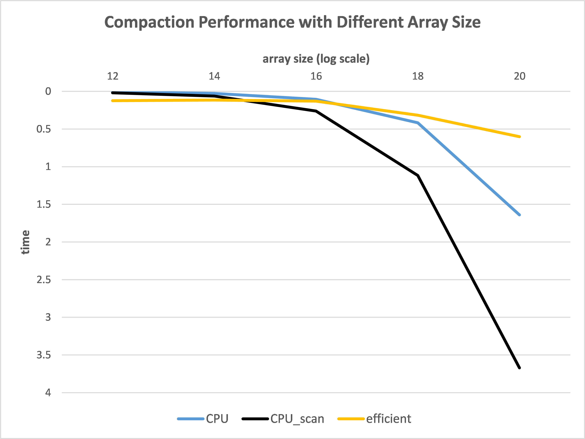

CUDA Stream Compaction
======================

**University of Pennsylvania, CIS 565: GPU Programming and Architecture, Project 2**

* Yichao Wang
  * [LinkedIn](https://www.linkedin.com/in/wangyic/) 
* Tested on: Windows 10 Home 64-bit (10.0, Build 18363)
  * Intel(R) Core(TM) i7-7700HQ CPU @ 2.80GHz (8 CPUs)
  * GeForce GTX 1060	6.1

## Description

This project implements Scan and Stream Compaction in various ways:

* Scan (all implementations support Non-Power-Of-Two input)
  * cpu
  * naive (gpu)
  * work-efficient (gpu, optimized indexing)
  * thrust (gpu)
* Stream Compaction
  * cpu without scan
  * cpu with scan
  * gpu with work-efficient scan

For more information, see [INSTRUCTION.md](INSTRUCTION.md).

## Performance Analysis

### Block Size Optimize


Note: ```NPOT stands for Non-Power-of-Two```

From above plot, we can see that there is no much difference between block sizes. So we choose block size of 512 for the following analysis.

### Implmentations Comparation




From above plots, we can see that the elapsed time increases as input size increases. However, there is no much difference for elapsed time when input size is non-power-of-two. Not surprising, thrust implmentation is the fastest one.

For stream compaction, we can see cpu without scan runs faster than cpu with scan. This is because cpu with scan requires three for loop while cpu without scan only requires one.

### Work Efficient Scan Optimization

Before the optimization, work efficient scan even runs slower than naive and cpu implementation. This is because not all threads are actually working. For example, if the input size is 1024, we only need 512 threads at most instead of 1024 for the first depth. This is because the additions is half of the size. Thus, to optimize the work efficient scan, I have adjusted the box amount according to the depth level and have changed index calculation in up-sweep and down-sweep method.


### Output for Scan and Stream Compaction Test (512 block size, 2^24 input size)

```

****************
** SCAN TESTS **
****************
    [  47   5  43  43  27  45   0  29   1  26   3   8  27 ...   2   0 ]
==== cpu scan, power-of-two ====
   elapsed time: 29.0025ms    (std::chrono Measured)
    [   0  47  52  95 138 165 210 210 239 240 266 269 277 ... 410953421 410953423 ]
==== cpu scan, non-power-of-two ====
   elapsed time: 29.5704ms    (std::chrono Measured)
    [   0  47  52  95 138 165 210 210 239 240 266 269 277 ... 410953326 410953375 ]
    passed
==== naive scan, power-of-two ====
   elapsed time: 24.2698ms    (CUDA Measured)
    [   0  47  52  95 138 165 210 210 239 240 266 269 277 ... 410953421 410953423 ]
    passed
==== naive scan, non-power-of-two ====
   elapsed time: 23.7513ms    (CUDA Measured)
    passed
==== work-efficient scan, power-of-two ====
   elapsed time: 9.78432ms    (CUDA Measured)
    passed
==== work-efficient scan, non-power-of-two ====
   elapsed time: 9.76662ms    (CUDA Measured)
    passed
==== thrust scan, power-of-two ====
   elapsed time: 1.13667ms    (CUDA Measured)
    passed
==== thrust scan, non-power-of-two ====
   elapsed time: 1.34381ms    (CUDA Measured)
    passed

*****************************
** STREAM COMPACTION TESTS **
*****************************
    [   2   0   0   0   1   3   3   0   2   3   3   2   2 ...   3   0 ]
==== cpu compact without scan, power-of-two ====
   elapsed time: 50.8381ms    (std::chrono Measured)
    [   2   1   3   3   2   3   3   2   2   3   1   3   3 ...   3   3 ]
    passed
==== cpu compact without scan, non-power-of-two ====
   elapsed time: 44.1896ms    (std::chrono Measured)
    [   2   1   3   3   2   3   3   2   2   3   1   3   3 ...   1   3 ]
    passed
==== cpu compact with scan ====
   elapsed time: 73.4177ms    (std::chrono Measured)
    [   2   1   3   3   2   3   3   2   2   3   1   3   3 ...   3   3 ]
    passed
==== work-efficient compact, power-of-two ====
   elapsed time: 13.1512ms    (CUDA Measured)
    passed
==== work-efficient compact, non-power-of-two ====
   elapsed time: 13.1215ms    (CUDA Measured)
    passed
Press any key to continue . . .
```
