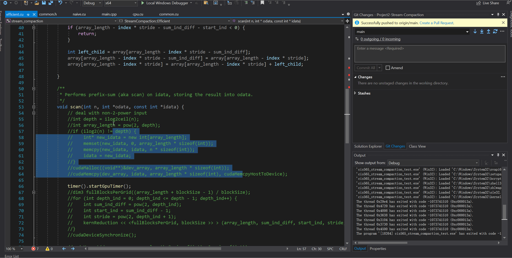

CUDA Stream Compaction
======================

**University of Pennsylvania, CIS 565: GPU Programming and Architecture, Project 2**

* Zirui Zang
  * [LinkedIn](https://www.linkedin.com/in/zirui-zang/)
* Tested on: Windows 10, AMD Ryzen 7 3700X @ 3.60GHz 32GB, RTX2070 SUPER 8GB (Personal)

### Results

In this lab I have implemented the scan (prefix-sum) and stream compaction alogrithm in three different ways:

1. CPU sequential method
2. GPU naive method, which parallelized the addition but has to iterate log(n) times.
3. GPU efficient method, which parallelized the whole process.

Additional attention has been given to utilizing shared memory in kernel computation to reduce global memory access. The array that needs to be operate on is pre-fetch into shared memory to scan operations can run within shared memory.

The code is also implementation so large input array can be split into GPU blocksizes and merged after computation.

Here are the results of my implementations:

Here are some issues with the code:
1. The efficient method doesn't run correctly with very large number of input. Possbibly due to block/thread synchronization issue.
2. The efficient method is not efficient at all.

### Discussions

The efficient method is not so efficient mainly due to complex kernel operations and excessive memory operations. In the upper and down sweep more than half of the threads are idle. This creates a lot of CUDA core occupation and very scattering memory access. If the numbers in the array can be more comgregated, we can launch fewer threads and save more time in seqential memory access.

### VS Studio useless machine

This is probably due to the autosync of my cloud.
