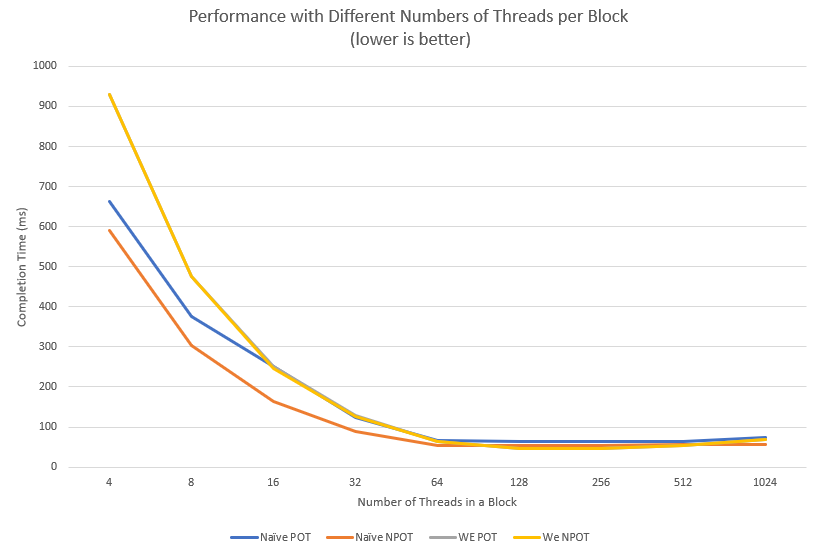
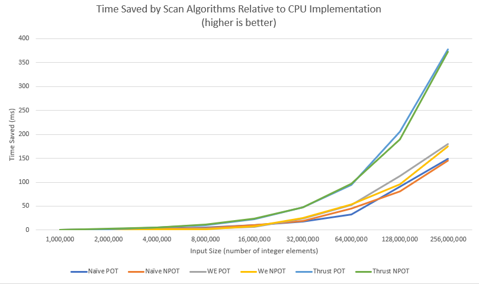

CUDA Stream Compaction
======================

**University of Pennsylvania, CIS 565: GPU Programming and Architecture, Project 2**

* Stephen Lee
  * [LinkedIn](https://www.linkedin.com/in/stephen-lee-bb5a40163/)
* Tested on: Windows 10, i7-9750H @2.60GHz, RTX 2060 6GB (personal laptop)

# Project Overview
The goal of this project was to analyze the performance of some useful algorithms. These `scan`, which computes a prefix sum on an input array. More can be read about prefix sums [here](https://en.wikipedia.org/wiki/Prefix_sum), as well as more information on the algorithms presented in this project. We then iterated on this scan implementation, creating a serial CPU algorithm, a naive parallel GPU algorithm, and a work-efficient parallel GPU algorithm. We then applied `scan` to compute other useful array operations such as `compaction` which is described in more detail [here](https://stackoverflow.com/questions/34059753/cuda-stream-compaction-algorithm).

### Features
* CPU `scan` and `compaction`
* Naive GPU implementation of `scan`
* Work-efficient GPU implementation of `scan` and `compaction`
* Wrapper for testing Thrust's `scan` implementation

# Performance Analysis
Performance was measured using provided GPU and CPU timing classes, which could accurately time each algorithm's runtime in milliseconds (ms). Performance analysis began by determining the optimal block size for which testing should be done. In all the graphs that will be presented, a few abbreviations were made to make the graphs more readable. These are as follows:

* WE = work-efficient
* POT = input size that is a power of 2
* NPOT = input size that is not a power of 2


### Finding an optimal block size
Block size refers to the number of threads defined in a block of threads in the launch paramters for the GPU parallel algorithms implemented. As such, only the GPU algorithms implemented in this project (naive and work-efficient) were tested here. A fixed input size of ~64,000,000 elements was used as a reasonably large input that would be conducive to using a CPU. Performance was measured for blocks whose sizes corresponded powers of 2 to work well with the underlying hardware in the range of 4 threads to 1024 threads in a block. The results are summarized in the graph below:



From this analysis, it was found that a block size of 128 threads per block made the most sense for all of our GPU algorithms on this test setup.

### Comparing scan algorithms
Once an optimal block size was determined, this was used to collect data on how the naive and work-efficient GPU implementations measured up to both the CPU version and the Thrust library which its own GPU implementation. The results for `scan` are summarized in the graph below:



It was found that input sizes below 1,000,000 elements tended to favor the CPU implementation as opposed to any of the GPU implementations. This is pretty sensible since the benefits of GPU programming are really only seen as input sizes get really large and we can leverage more parallel computations. As such, I have only plotted data for input sizes above 1,000,000 since smaller inputs were not particularly interesting. The naive implementation of `scan` tended to perform better than the work-efficient implementation up until 32,000,000 elements, at which point the work-efficient method took over. In both cases, Thrust's implementation is far superior saving much more time than either of my implementations.

This difference in performance can likely be attributed to a memory I/O bottleneck since both the naive and work-efficient implementations are doing many reads and writes to global memory, and there aren't really any other computations that are being done to cover up this latency. Regarding the differences observed between the naive implementation and the work-efficient implementation, this is likely due to the asymptotic behavior of the implementations, where the naive implementation has fewer serial operations for smaller input sizes than the work-efficient version.

### Comparing compaction algorithms
After analyzing the performance of `scan`, the `compaction` algorithm was used as an application of what we had just implemented. In this case, we compare the perfomance of a purely CPU-inspired approach, a CPU approach that uses `scan` as a intermediate computation, and a GPU approach that uses our work-efficient implementation. Like with the scan implementation, we didn't really see the GPU pull ahead of the CPU until 1,000,000 elements were added into the array, so the graph below starts at this point.


Here we see some similar trends, where the difference between the CPU versions and the work-efficient GPU version increased with increasing input size (e.g. the difference between the lines got bigger with larger inputs). Since this algorithm is largely an extension of `scan` with a few extra computations, it makes sense that we see a very similar trend here.

Here's a sample output with 131072 elements to be processed:
```
****************
** SCAN TESTS **
****************
    [   8  20  33  38  32  34  23   5  38   7  22  39  15 ...  24   0 ]
==== cpu scan, power-of-two ====
   elapsed time: 0.1906ms    (std::chrono Measured)
    [   0   8  28  61  99 131 165 188 193 231 238 260 299 ... 3206154 3206178 ]
==== cpu scan, non-power-of-two ====
   elapsed time: 0.1897ms    (std::chrono Measured)
    [   0   8  28  61  99 131 165 188 193 231 238 260 299 ... 3206075 3206103 ]
    passed
==== naive scan, power-of-two ====
   elapsed time: 0.346464ms    (CUDA Measured)
    [   0   8  28  61  99 131 165 188 193 231 238 260 299 ... 3206154 3206178 ]
    passed
==== naive scan, non-power-of-two ====
   elapsed time: 0.249376ms    (CUDA Measured)
    [   0   8  28  61  99 131 165 188 193 231 238 260 299 ...   0   0 ]
    passed
==== work-efficient scan, power-of-two ====
   elapsed time: 0.535904ms    (CUDA Measured)
    [   0   8  28  61  99 131 165 188 193 231 238 260 299 ... 3206154 3206178 ]
    passed
==== work-efficient scan, non-power-of-two ====
   elapsed time: 0.49104ms    (CUDA Measured)
    [   0   8  28  61  99 131 165 188 193 231 238 260 299 ... 3206075 3206103 ]
    passed
==== thrust scan, power-of-two ====
   elapsed time: 0.4896ms    (CUDA Measured)
    [   0   8  28  61  99 131 165 188 193 231 238 260 299 ... 3206154 3206178 ]
    passed
==== thrust scan, non-power-of-two ====
   elapsed time: 0.416352ms    (CUDA Measured)
    [   0   8  28  61  99 131 165 188 193 231 238 260 299 ... 3206075 3206103 ]
    passed

*****************************
** STREAM COMPACTION TESTS **
*****************************
    [   2   2   1   2   2   0   1   3   0   1   0   3   1 ...   0   0 ]
==== cpu compact without scan, power-of-two ====
   elapsed time: 0.3009ms    (std::chrono Measured)
    [   2   2   1   2   2   1   3   1   3   1   2   3   3 ...   2   3 ]
    passed
==== cpu compact without scan, non-power-of-two ====
   elapsed time: 0.2984ms    (std::chrono Measured)
    [   2   2   1   2   2   1   3   1   3   1   2   3   3 ...   2   3 ]
    passed
==== cpu compact with scan ====
   elapsed time: 0.7242ms    (std::chrono Measured)
    [   2   2   1   2   2   1   3   1   3   1   2   3   3 ...   2   3 ]
    passed
==== work-efficient compact, power-of-two ====
   elapsed time: 0.915008ms    (CUDA Measured)
    [   2   2   1   2   2   1   3   1   3   1   2   3   3 ...   2   3 ]
    passed
==== work-efficient compact, non-power-of-two ====
   elapsed time: 0.89984ms    (CUDA Measured)
    [   2   2   1   2   2   1   3   1   3   1   2   3   3 ...   2   3 ]
    passed
```

# Bloopers
The greatest issue that I ran into while working on this project was related to the down-sweep on my work-efficient scan. The bounds on my loop controlling the down sweep kernel invocations had been wrong intially:

```
cudaMemset(&dev_data[pow2 - 1], 0, sizeof(int));
for (int d = maxDepth; d >= 0; d--) { // this should be d = maxDepth - 1 instead
    kernDownSweep << <fullBlocksPerGrid, blockSize >> > (pow2, d, dev_data);
}
```
This caused illegal memory accesses in the kernel, which I found surprising since I didn't find out about the error until the kernels had finished and I went to free the memory. I had actually not checked for errors after I freed initially, so the problem would spill over into the next call's malloc. Even weirder, when I ran the code in the NSight debugger, it would set an automatic breakpoint in the kernel and would be able to properly calculate the result. I'm not really sure why this happened, but there's definitely something that I'm missing about this.

Here's the output:
```
****************
** SCAN TESTS **
****************
    [  34  24   8  17  15  39  31  25  19   9  26  19  26 ...   8   0 ]
==== cpu scan, power-of-two ====
   elapsed time: 0.7537ms    (std::chrono Measured)
    [   0  34  58  66  83  98 137 168 193 212 221 247 266 ... 12833463 12833471 ]
==== cpu scan, non-power-of-two ====
   elapsed time: 0.7565ms    (std::chrono Measured)
    [   0  34  58  66  83  98 137 168 193 212 221 247 266 ... 12833421 12833452 ]
    passed
==== naive scan, power-of-two ====
   elapsed time: 0.510144ms    (CUDA Measured)
    [   0  34  58  66  83  98 137 168 193 212 221 247 266 ... 12833463 12833471 ]
    passed
==== naive scan, non-power-of-two ====
   elapsed time: 0.507712ms    (CUDA Measured)
    [   0  34  58  66  83  98 137 168 193 212 221 247 266 ...   0   0 ]
    passed
==== work-efficient scan, power-of-two ====
CUDA error: cudaFree failed on dev_data!: an illegal memory access was encountered
```

