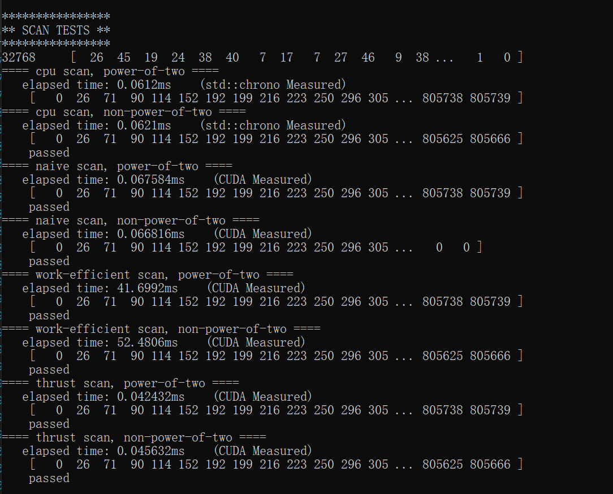

CUDA Stream Compaction
======================

**University of Pennsylvania, CIS 565: GPU Programming and Architecture, Project 2**

* Bowen Deng
  * [LinkedIn](www.linkedin.com/in/bowen-deng-7dbw13), [twitter](https://twitter.com/7Dbw13)
* Tested on: Windows 10, AMD Ryzen 9 5900HX with Radeon Graphics @ 3.30GHz 16GB, GeForce RTX 3070 Laptop GPU 8GB (Personal Computer)

## Abstract

GPU stream compaction and scan (prefix sum) algorithm implemented in CUDA.
> Examples

* scan:
  - goal: produce a prefix sum array of a given array (we only care about exclusive scan here)
  - input
    - [1 5 0 1 2 0 3]
  - output
    - [0 1 6 6 7 9 9]
* compact:
  - goal: closely and neatly packed the elements != 0
  - input
    - [1 5 0 1 2 0 3]
  - output
    - [1 5 1 2 3]

Different kinds of scan algorithms implemented in this project:

1. CPU based scan
2. Naive GPU scan
3. Work-Efficient GPU scan
4. GPU scan using Thrust
5. Upgraded GPU efficient scan (*extra credit*)
6. GPU scan using shared memory (*extra credit*)

Different kinds of compaction implemented in this project:

1. CPU based compaction
2. CPU compaction using scan
3. GPU compaction using work-efficient GPU scan

## CMake Note

The `CMakeLists.txt` files are modified. New files are added in the following way

```
.
└── stream_compaction
    ├── radix_sort.cu
    └── radix_sort.h
```

## Output

Run the test program on array with size `65536`
```
****************
** SCAN TESTS **
****************
    [  29  17   2   3  30  15  27  26  30   1   2  23   4 ...  43   0 ]
==== cpu scan, power-of-two ====
   elapsed time: 0.0295ms    (std::chrono Measured)
    [   0  29  46  48  51  81  96 123 149 179 180 182 205 ... 1610735 1610778 ]
==== cpu scan, non-power-of-two ====
   elapsed time: 0.0266ms    (std::chrono Measured)
    [   0  29  46  48  51  81  96 123 149 179 180 182 205 ... 1610664 1610685 ]
    passed
==== naive scan, power-of-two ====
   elapsed time: 0.093184ms    (CUDA Measured)
    passed
==== naive scan, non-power-of-two ====
   elapsed time: 0.093184ms    (CUDA Measured)
    passed
==== work-efficient scan, power-of-two ====
   elapsed time: 0.089088ms    (CUDA Measured)
    passed
==== work-efficient scan, non-power-of-two ====
   elapsed time: 0.090112ms    (CUDA Measured)
    passed
==== work-efficient-upgraded scan, power-of-two ====
   elapsed time: 0.090112ms    (CUDA Measured)
    passed
==== work-efficient-upgraded scan, non-power-of-two ====
   elapsed time: 0.089088ms    (CUDA Measured)
    passed
==== work-efficient-shared scan, power-of-two ====
   elapsed time: 0.038912ms    (CUDA Measured)
    passed
==== work-efficient-shared scan, non-power-of-two ====
   elapsed time: 0.038912ms    (CUDA Measured)
    passed
==== thrust scan, power-of-two ====
   elapsed time: 0.041984ms    (CUDA Measured)
    passed
==== thrust scan, non-power-of-two ====
   elapsed time: 0.045056ms    (CUDA Measured)
    passed

*****************************
** STREAM COMPACTION TESTS **
*****************************
    [   1   1   0   3   0   3   3   0   0   3   0   1   2 ...   3   0 ]
==== cpu compact without scan, power-of-two ====
   elapsed time: 0.1044ms    (std::chrono Measured)
    [   1   1   3   3   3   3   1   2   2   3   3   1   3 ...   1   3 ]
    passed
==== cpu compact without scan, non-power-of-two ====
   elapsed time: 0.1054ms    (std::chrono Measured)
    [   1   1   3   3   3   3   1   2   2   3   3   1   3 ...   3   3 ]
    passed
==== cpu compact with scan ====
   elapsed time: 0.2209ms    (std::chrono Measured)
    passed
==== work-efficient compact, power-of-two ====
   elapsed time: 0.136256ms    (CUDA Measured)
    passed
==== work-efficient compact, non-power-of-two ====
   elapsed time: 0.137216ms    (CUDA Measured)
    passed
```

## Performance Analysis

### Measurement Metric

`std::chrono` and CUDA event are applied to measure the time cost of algorithms on CPU and GPU respectively. The unit used for timing is `ms`.

### Block Size Optimization

To optimize the block sizes for each kind of scan algorithm, I run all GPU algorithms with different block sizes on an array with size `65536`. The results are shown as below


According to this, the block size of the upgraded GPU efficient scan is chosen to be `128`, while all others are set to be `256`.

### Scan Performance with Different Array Size



From the result we can see:

- The CPU based scan performs surprisingly well for a small array, but as the size grows, its performance drops dramatically due to high computation complexity.
- The naive GPU scan is even worse than the CPU method, and its performance also drops for a large size since the computation is also complex.
- The work-efficient GPU scan has a performance similar to naive method at first, but it outperforms both naive GPU and CPU scans when the size is large enough. It can be considered that memory I/Os limits the performance for small arrays.
- The Thrust GPU scan is robust. Its performance curve shows almost a linear increment.
- The upgraded GPU efficient scan and GPU scan using shared memory will be talked about with details in extra credit part.

### Compaction Performance with Different Array Size


Notice that when scan is applied, the performance of CPU compaction drops sharply. This is because scan brings additional computation to the compaction algorithm, which is necessary for parallel computing in GPU method.

## Extra Credit

### Why is My GPU Approach So Slow

Obviously, the work-efficient GPU scan is not so efficient that it is even worse than the CPU based scan and similar to naive GPU scan, when the size of array is not large enough. The reason is that as the loop level of upper/down sweep goes deeper, more and more threads becomes inactive. Let's take a look into this part for example
```
int index = threadIdx.x + (blockIdx.x * blockDim.x);
if (index >= n) {
    return;
}

// Only for multiple of 2^(d+1)
if ((index & ((1 << (d + 1)) - 1)) == 0) {
    idata[index + (1 << (d + 1)) - 1] += idata[index + (1 << d) - 1];
}
```
The code above performs reduction on `idata`. Note the `if` condition here. Every loop `d` is increased by `1`, and so the number of threads, whose `index` meets the condition, will be halved. These threads do nothing actually.

To resolve this, I multiply `index` of each thread by `2^(d+1)`. Now all threads with new `index` less than `n` satisfy the previous condition. A new version is like
```
unsigned long int index = threadIdx.x + (blockIdx.x * blockDim.x);

// Index hack
// Make use of all threads
index *= (1 << (d + 1));

if (index >= n) {
    return;
}

// 'index' is now multiple of 2^(d+1)
idata[index + (1 << (d + 1)) - 1] += idata[index + (1 << d) - 1];
```
Thus each thread is utilized. At the same time, since the total number of active threads stays unchanged, the number of blocks launched should be halved every loop
```
// Reduction for log(n) times
for (int d = 0; d < ilog2ceil(n); d++) {
    // Halve the number of blocks launched in each turn
    act_n /= 2;
    dim3 fullBlocksPerGrid((act_n + BLOCK_SIZE_UPGRADED - 1) / BLOCK_SIZE_UPGRADED);
    kern_reduction << <fullBlocksPerGrid, BLOCK_SIZE_UPGRADED >> > (n, d, idata);
    checkCUDAError("kern_reduction failed!");
}
```
As a result, a performance gain can be observed in the performance figure when the size of array is large enough.

### Radix Sort

A radix sort is implemented using the upgraded GPU efficient scan in `radix_sort.cu`. It can be called by
```
Sort::radix_sort(int n, int num_bits, int *odata, const int *idata);
```
where `n` is the length of the array, and `num_bits` refers to number of bits in keys. This function sorts `idata` from smaller to larger and stores the result to `odata`.

The result of test added in `main.cpp` is (`5`-bit keys, array size `16`)
```
***************
** SORT TEST **
***************
    [  18  14   7  11  16   5   3  10   1  25  21  11  13   3  19  16 ]
==== radix sort, power-of-two ====
    [   1   3   3   5   7  10  11  11  13  14  16  16  18  19  21  25 ]
==== radix sort, non-power-of-two ====
    [   1   3   5   7  10  11  11  13  14  16  18  21  25 ]
```

### GPU Scan Using Shared Memory

The shared memory-based scan is implemented according to [GPU Gem Ch 39](https://developer.nvidia.com/gpugems/GPUGems3/gpugems3_ch39.html). However, due to the memory limitation, the original method can only handle arrays with size smaller than twice the maximal number of threads in one block (`2048` for my computer).

To resolve this, first I break the input array into blocks, and then run the original scan on each block. The sum of each block is stored into a new array. The increments between blocks can be computed by scanning this new array. Finally adding these increments to each element in the corresponding block results in a fully-scanned array.

From the performance figure, this method shows significantly improvement on the performance, and it even beats Thrust scan in my experiment settings.
