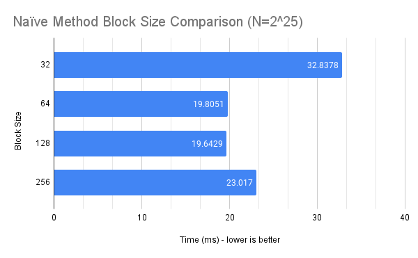

CUDA Stream Compaction
======================

**University of Pennsylvania, CIS 565: GPU Programming and Architecture, Project 2**

* Wayne Wu
  * [LinkedIn](https://www.linkedin.com/in/wayne-wu/), [Personal Website](https://www.wuwayne.com/)
* Tested on: Windows 10, AMD Ryzen 5 5600X @ 3.70GHz 32GB, RTX 3070 8GB (personal)

## Background

This project examines two fundamental GPU programming algorithms, **Scan** and **Stream Compaction**.

### Scan
Scanning is the process of calculating the prefix sums of all elements in an array. Five different implementations are examined in this project:

1. **CPU**: 
Non-parallelized scanning in CPU. 
2. **GPU Naive**: 
Naively parallelized setup.
3. **GPU Work Efficient**:
Parallelized setup that reduces the amount of work required by breaking the scanning process into two phases: reduce phase and down-sweep phase. See `kernUpSweep()` and `kernDownSweep()` kernels for implementation details.
4. **GPU Work Efficient with Shared Memory (Extra Credit)**:
Based on the concept from 3, both reduction and down-sweep phases are now done in one kernel (`kernScan()`) using shared memory. In order to support **an array of arbitrary size**, the implementation uses the block-sum method to recursively divide the array into manageable chunks by each block and aggregate divided results together using an auxiliary array (See `recursiveScan()`).
5. **GPU using Thrust API**:
Uses the `inclusive_scan()` call from the Thrust library.

### Stream Compaction
Stream compaction is the process of only keeping the elements in an array that satisfy a specific condition, thereby compacting the array. Three different implementations are examined in this project:

1. **CPU without Scan**:
Non-parallelized compaction without using scan functions.
2. **CPU with Scan**
Non-parallelized compaction that uses the scan and scatter paradigm of stream compaction.
3. **GPU Work Efficient**
Parallelized setup that uses the scan and scatter paradigm of stream compaction.
The scan function used is identical to Implementation 3 of scanning (i.e. `kernUpSweep()` and `kernDownSweep()`).

### Power of Two
All implementations are made to support both an array size that is a power of two and one that isn't.

## Optimal Block Sizes

We begin by optimizing the block sizes for each implementation such that all implementations are analyzed and compared in the optimized state.

### GPU Naive: **128**


*Figure 1. GPU Naive Implementation Block Size Comparison*

### GPU Work-Efficient: **128**


*Figure 2. GPU Work-Efficient (w/o Shared Memory) Implementation Block Size Comparison*

It should be noted here that the algorithm also dynamically shrinks/grows the block size depending on the iteration depth, such that the index value does not overflow. 128 is the optimal starting block size.


### GPU Work-Efficient with Shared Memory: **128**
This implementation does not use a `blockSize` variable unlike the previous two methods. 
Instead, a `B` variable is used which is the number of elements that will be processed by each block.
The actual number of threads required is `B/2`.

The optimal `B` value is 128, as all other `B` values fail at `N = 2^25`.

## Sample Output
Below is the output of the test program used for testing and timing the different implementations. `N = 2^24`.
```
****************
** SCAN TESTS **
****************
    [   3  42  32  13  26  31  45   7  20   2   5   1  10 ...   1   0 ]
==== cpu scan, power-of-two ====
   elapsed time: 9.7722ms    (std::chrono Measured)
    [   3  45  77  90 116 147 192 199 219 221 226 227 237 ... 410841500 410841500 ]
==== cpu scan, non-power-of-two ====
   elapsed time: 9.9391ms    (std::chrono Measured)
    [   3  45  77  90 116 147 192 199 219 221 226 227 237 ... 410841449 410841488 ]
    passed
==== naive scan, power-of-two ====
   elapsed time: 9.41562ms    (CUDA Measured)
    [   3  45  77  90 116 147 192 199 219 221 226 227 237 ... 410841500 410841500 ]
    passed
==== naive scan, non-power-of-two ====
   elapsed time: 9.46506ms    (CUDA Measured)
    [   3  45  77  90 116 147 192 199 219 221 226 227 237 ...   0   0 ]
    passed
==== work-efficient scan, power-of-two ====
   elapsed time: 4.65533ms    (CUDA Measured)
    [   3  45  77  90 116 147 192 199 219 221 226 227 237 ... 410841500 410841500 ]
    passed
==== work-efficient scan, non-power-of-two ====
   elapsed time: 4.6632ms    (CUDA Measured)
    [   3  45  77  90 116 147 192 199 219 221 226 227 237 ... 410841449 410841488 ]
    passed
==== work-efficient scan (shared memory, recursive), power-of-two ====
   elapsed time: 0.965856ms    (CUDA Measured)
    [   3  45  77  90 116 147 192 199 219 221 226 227 237 ... 410841500 410841500 ]
    passed
==== work-efficient scan (shared memory, recursive), non-power-of-two ====
   elapsed time: 1.99728ms    (CUDA Measured)
    [   3  45  77  90 116 147 192 199 219 221 226 227 237 ... 410841449 410841488 ]
    passed
==== thrust scan, power-of-two ====
   elapsed time: 0.47568ms    (CUDA Measured)
    [   3  45  77  90 116 147 192 199 219 221 226 227 237 ... 410841500 410841500 ]
    passed
==== thrust scan, non-power-of-two ====
   elapsed time: 0.976416ms    (CUDA Measured)
    [   3  45  77  90 116 147 192 199 219 221 226 227 237 ... 410841449 410841488 ]
    passed

*****************************
** STREAM COMPACTION TESTS **
*****************************
    [   0   2   2   1   0   0   3   2   2   2   1   1   3 ...   0   0 ]
==== cpu compact without scan, power-of-two ====
   elapsed time: 24.0027ms    (std::chrono Measured)
    [   2   2   1   3   2   2   2   1   1   3   1   3   2 ...   3   3 ]
    passed
==== cpu compact without scan, non-power-of-two ====
   elapsed time: 24.8678ms    (std::chrono Measured)
    [   2   2   1   3   2   2   2   1   1   3   1   3   2 ...   3   3 ]
    passed
==== cpu compact with scan ====
   elapsed time: 56.7523ms    (std::chrono Measured)
    [   2   2   1   3   2   2   2   1   1   3   1   3   2 ...   3   3 ]
    passed
==== work-efficient compact, power-of-two ====
   elapsed time: 8.44557ms    (CUDA Measured)
    [   2   2   1   3   2   2   2   1   1   3   1   3   2 ...   3   3 ]
    passed
==== work-efficient compact, non-power-of-two ====
   elapsed time: 8.28093ms    (CUDA Measured)
    [   2   2   1   3   2   2   2   1   1   3   1   3   2 ...   3   3 ]
    passed
Press any key to continue . . .

```

## Performance Analysis

### Scan


*Figure 3. Scan Algorithm Performance Comparison (Power of 2)*

From Figure 3, we can observe the following:
* **GPU Naive** implementation is equally inefficient as the CPU implementation
* **GPU Work-Efficient** implementation is better than the CPU implementation.
However the trajectory of the curve still implies that it is getting exponentially slower with larger elements.
* **GPU Work-Efficient with Shared Memory** is significantly more efficient than without shared memory.
* **GPU Thrust** implementation is the fastest out of all.

#### GPU Work-Efficient
The work-efficient algorithm (without shared memory) is faster than the naive approach as there is overall less work to do for scanning. However, the performance bottlenecks are still noticeable as they mainly come from:
1. Accessing Global Memory - there are lots of read and write operations from/to the global memory.
2. Unused Threads - there are many threads that are unused, especially when the index offset is large.
3. Memory Random Access - global memory are accessed randomly with no particular order.

To fix these, we can:
1. Use Shared Memory - this is essentially the shared memory scanning implementation as discussed in the next section.
2. Use Warp Partitioning - ensure that all the non-active threads are under the same warp so that the warp can be deactivated automatically once the warp is no longer in use.
3. Ensure Memory Coalescing - ensure that we're accessing memory contiguously by rearranging the data array in each iteration.

#### GPU Work-Efficient with Shared Memory
By using shared memory, the need of accessing global memory is significantly reduced. Additionally, shared memory is faster with random memory access. Therefore, problem 1 and problem 3 from above are greatly alleviated. However, with the usage of shared memory, we also introduce a bottleneck from **bank conflicts**. As such, there is still space for improvement once we remove the bank conflicts.

#### GPU Thrust


*Figure 4. Nsight timeline for the Thrust implementation*

If we look at the Nsight timeline for the Thrust implementation, we can see that it calls the `cudaMemcpyAsync` function instead of `cudaMemcpy` like all other implementations. This suggests that there may be an asynchronous process going on in Thrust's implementation that copies the buffer data while another process is running, thus having some performance gain.

#### Non Power of 2


*Figure 5. Scan Algorithm Performance Comparison (Non Power of 2)*

There is no significant performance difference between power-of-two sized versus. non-power-of-two-sized arrays.

### Stream Compaction


*Figure 5. Stream Compaction Algorithm Performance Comparison (Non Power of 2)*

As the stream compaction algorithm uses the GPU Work-Efficient (w/o Shared Memory) scan function,
it naturally follows the same performance result. Performance gain can be achieved by alleviating the problems discussed above.
